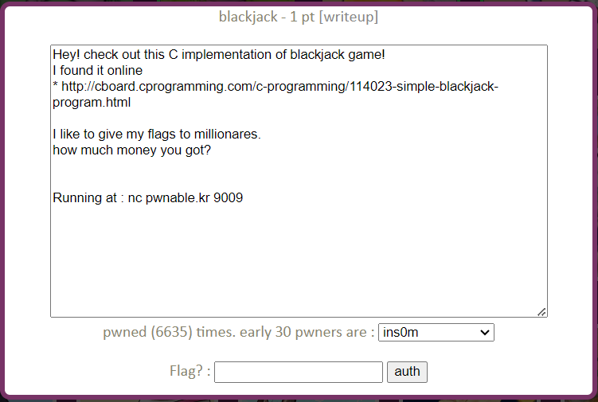
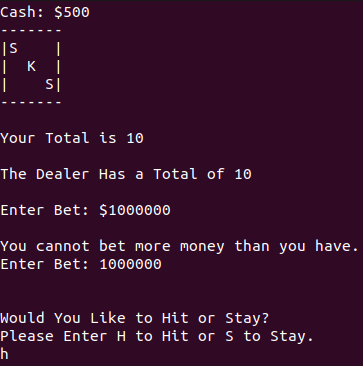
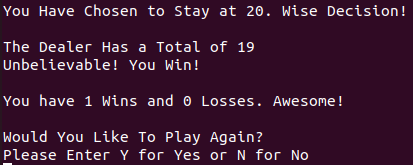
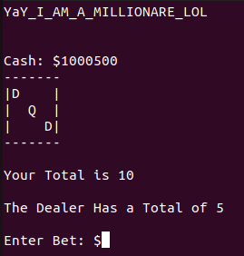

blackjack Solution
======================



주어진 링크에 접속하면 C로 구현된 블랙잭 게임의 소스 코드가 있다. 게임에서 백만장자가 되면 플래그를 얻을 수 있다고 되어 있다. pwnable.kr 9009 포트로 접속해 보면 링크의 소스 코드로 구현된 듯한 블랙잭 게임이 실행된다. 소스 코드를 분석해 백만장자가 될 방법을 찾아보자.

게임 규칙을 출력하는 rules() 함수의 일부를 보자.

- rules()
```c
     printf("\n           RULES of VLAD's BLACKJACK");
     printf("\n          ---------------------------");
     printf("\nI.");
     printf("\n     Thou shalt not question the odds of this game.");
     printf("\n      %c This program generates cards at random.", spade);
     printf("\n      %c If you keep losing, you are very unlucky!\n", diamond);
      
     printf("\nII.");
     printf("\n     Each card has a value.");
     printf("\n      %c Number cards 1 to 10 hold a value of their number.", spade);
     printf("\n      %c J, Q, and K cards hold a value of 10.", diamond);
     printf("\n      %c Ace cards hold a value of 11", club);
     printf("\n     The goal of this game is to reach a card value total of 21.\n");
      
     printf("\nIII.");
     printf("\n     After the dealing of the first two cards, YOU must decide whether to HIT or STAY.");
     printf("\n      %c Staying will keep you safe, hitting will add a card.", spade);
     printf("\n     Because you are competing against the dealer, you must beat his hand.");
     printf("\n     BUT BEWARE!.");
     printf("\n      %c If your total goes over 21, you will LOSE!.", diamond);
     printf("\n     But the world is not over, because you can always play again.\n");
     printf("\n%c%c%c YOUR RESULTS ARE RECORDED AND FOUND IN SAME FOLDER AS PROGRAM %c%c%c\n", spade, heart, club, club, heart, spade);
```

일반적으로 알고 있는 블랙잭의 기본 룰과 동일하다. split과 같은 선택지는 없고 hit, stay만 고를 수 있다. Ace 카드가 11로 해석된다고 되어 있으나 소스 코드를 살펴 보면 1, 11로 맞추어 사용할 수 있도록 코딩돼있다. 

카드가 랜덤으로 생성된다고 적혀있다. 의심스러우니 카드 생성을 담당하는 randcard(), dealer() 함수를 확인했다.

- randcard()

```c
int randcard() //Generates random card
{
      
                
     srand((unsigned) time(NULL)); //Generates random seed for rand() function
     random_card = rand()%4+1;
      
     if(random_card==1)
     {   
         clubcard();
         l=k;
     }
      
     if(random_card==2)
     {
         diamondcard();
         l=k;
     }
      
     if(random_card==3)
     {
         heartcard();
         l=k;
     }
          
     if(random_card==4)
     {
         spadecard();
         l=k;
     }    
     return l;
} // End Function   
```

randcard() 에서는 카드의 문양을 랜덤으로 설정하고 문양에 해당하는 카드의 숫자를 생성하고 출력하는 Xcard() 함수를 호출한다. 출력하는 문양 외에 다른 부분은 모두 동일하니 clubcard() 함수만 보자.

- clubcard()

```c
int clubcard() //Displays Club Card Image
{
     
     
    srand((unsigned) time(NULL)); //Generates random seed for rand() function
    k=rand()%13+1;
     
    if(k<=9) //If random number is 9 or less, print card with that number
    {
    //Club Card
    printf("-------\n");
    printf("|%c    |\n", club);
    printf("|  %d  |\n", k);
    printf("|    %c|\n", club);
    printf("-------\n");
    }
     
     
    if(k==10) //If random number is 10, print card with J (Jack) on face
    {
    //Club Card
    printf("-------\n");
    printf("|%c    |\n", club);
    printf("|  J  |\n");
    printf("|    %c|\n", club);
    printf("-------\n");
    }
     
     
    if(k==11) //If random number is 11, print card with A (Ace) on face
    {
    //Club Card
    printf("-------\n");
    printf("|%c    |\n", club);
    printf("|  A  |\n");
    printf("|    %c|\n", club);
    printf("-------\n");
    if(player_total<=10) //If random number is Ace, change value to 11 or 1 depending on dealer total
         {
             k=11;
         }
          
         else
         {
 
             k=1;
         }
    }
     
     
    if(k==12) //If random number is 12, print card with Q (Queen) on face
    {
    //Club Card
    printf("-------\n");
    printf("|%c    |\n", club);
    printf("|  Q  |\n");
    printf("|    %c|\n", club);
    printf("-------\n");
    k=10; //Set card value to 10
    }
     
     
    if(k==13) //If random number is 13, print card with K (King) on face
    {
    //Club Card
    printf("-------\n");
    printf("|%c    |\n", club);
    printf("|  K  |\n");
    printf("|    %c|\n", club);
    printf("-------\n");
    k=10; //Set card value to 10
    }
    return k;           
}// End function
```

조금 신경 쓰이는 부분이 있으나 큰 문제는 없어 보인다. 딜러의 카드를 생성하는 dealer() 함수도 살펴보자.

- dealer()

```c
void dealer() //Function to play for dealer AI
{
     int z;
      
     if(dealer_total<17)
     {
      srand((unsigned) time(NULL) + 1); //Generates random seed for rand() function
      z=rand()%13+1;
      if(z<=10) //If random number generated is 10 or less, keep that value
      {
         d=z;
          
      }
      
      if(z>11) //If random number generated is more than 11, change value to 10
      {
         d=10;
      }
      
      if(z==11) //If random number is 11(Ace), change value to 11 or 1 depending on dealer total
      {
         if(dealer_total<=10)
         {
             d=11;
         }
          
         else
         {
             d=1;
         }
      }
     dealer_total = dealer_total + d;
     }
           
     printf("\nThe Dealer Has a Total of %d", dealer_total); //Prints dealer total
      
} // End Function 
```

딜러의 현재 숫자 총 합이 17 미만이면 hit을 하는 구조로 짜여져 있다. 이외에 카드 숫자를 정하는 방식은 플레이어와 동일하다. 카드의 생성이 공정하게 이루어지므로 쉽게 100만 달러를 얻을 수는 없을 것 같다. 다만, 딜러의 총합이 17 이상인 경우 hit을 하지 않고, 17 미만인 경우 무조건 hit을 한다는 사실을 알고 있기 때문에 플레이어가 조금 유리하게 게임을 진행할 수 있을 것이다. 여기서 플레이어가 가장 승률이 높은 선택을 하는 알고리즘을 구현하려 했으나, 우선 코드의 남은 부분을 더 살펴보기로 했다.

결국 게임의 목적은 100만 달러 이상을 버는 것이다. 이 게임에서 플레이어의 돈을 조작하는 함수는 play(), stay(), betting(), cash_test() 함수이다. play(), stay(), cash_test()는 큰 이상 없이 플레이어의 돈을 조작하고 있다. 문제는 betting() 함수에서 발생한다.

- betting()

```c
int betting() //Asks user amount to bet
{
 printf("\n\nEnter Bet: $");
 scanf("%d", &bet);
 
 if (bet > cash) //If player tries to bet more money than player has
 {
        printf("\nYou cannot bet more money than you have.");
        printf("\nEnter Bet: ");
        scanf("%d", &bet);
        return bet;
 }
 else return bet;
} // End Function
```

betting() 함수는 플레이어에게 베팅할 금액을 입력 받아 전역 변수 bet에 저장하고 리턴하는 함수이다. 보유 중인 돈을 저장하고 있는 cash 값 보다 입력 받은 bet 값이 큰 경우 가진 돈보다 많은 돈을 베팅할 수 없다는 메시지 출력과 함께 다시 베팅 금액 입력을 받는다. 여기 두 번째 입력에서는 bet이 cash보다 큰지 확인하지 않고 그대로 값을 저장하고 리턴한다. 따라서 첫 번째 입력에 보유 금액보다 큰 금액을 입력하고, 두 번째 입력에서 100만 달러 이상을 입력하면 전역 변수 bet은 100만 이상의 값을 가지게 된다. 이후 게임을 이기면 보유 금액이 100만 달러가 넘게 되어 flag를 얻을 수 있다.







"YaY_ ..." 가 이번 문제의 flag이다. 