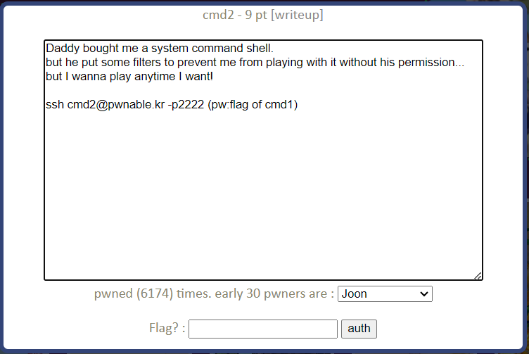
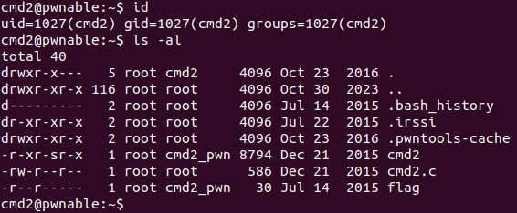
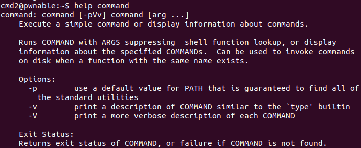
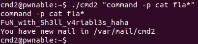

cmd2 Solution
=====================



cmd1과 비슷하게 필터가 적용된 system command shell이 구현된 듯 하다. 서버에 접속해 보자.



현재 사용자와 디렉터리 정보다. cmd2와 cmd2.c를 이용해 flag를 얻어야 한다. cmd2.c의 내용을 보자.

- cmd2.c

```c
#include <stdio.h>
#include <string.h>

int filter(char* cmd){
	int r=0;
	r += strstr(cmd, "=")!=0;
	r += strstr(cmd, "PATH")!=0;
	r += strstr(cmd, "export")!=0;
	r += strstr(cmd, "/")!=0;
	r += strstr(cmd, "`")!=0;
	r += strstr(cmd, "flag")!=0;
	return r;
}

extern char** environ;
void delete_env(){
	char** p;
	for(p=environ; *p; p++)	memset(*p, 0, strlen(*p));
}

int main(int argc, char* argv[], char** envp){
	delete_env();
	putenv("PATH=/no_command_execution_until_you_become_a_hacker");
	if(filter(argv[1])) return 0;
	printf("%s\n", argv[1]);
	system( argv[1] );
	return 0;
}
```

cmd1.c와 비슷한 구조를 갖고 있다. 다른 점은 프로그램을 실행하면 환경 변수 값을 모두 0으로 초기화하고, 필터에서 더 많은 단어를 걸러내는 것이다. "=", "export", "/"와 같은 문자열이 걸러지므로 cmd1과 같이 절대 경로를 이용해 /bin/cat을 실행하거나, PATH 환경 변수를 변경해 cat을 실행할 수 없다. 리눅스에는 "command" 라는 명령어가 있다. 



"command" 명령어는 명령어를 실행하거나 명령어에 관련한 정보를 제공한다. "command"의 -p 옵션은 PATH 환경 변수 기본 값을 사용해 명령어를 실행해준다. cmd2에서 이 옵션을 적용한 "command"를 사용하면 "/no_command_execution_until_you_become_a_hacker" 으로 변경되었던 PATH 값이 기본 값으로 변경되어 절대 경로 없이 cat 명령어를 사용할 수 있게 된다.

```bash
$ ./cmd2 "command -p cat fla*"
```

"flag"도 필터에 걸리는 단어이므로 와일드 카드를 이용해 우회하였다.



PATH가 디폴트 값으로 변경되어 cat 명령어가 정상적으로 실행되는 것을 볼 수있다. "FuN_with ..." 가 이번 문제의 flag이다.