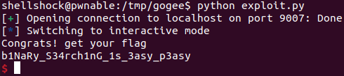

coin1 Solution
======================


이번 문제에는 큰 설명이 없다. "nc pwnable.kr 9007"에 접속해 어떤 문제인지 확인해 보자.

- pwnable.kr, port:9007

```
    ---------------------------------------------------
	-              Shall we play a game?              -
	---------------------------------------------------
	
	You have given some gold coins in your hand
	however, there is one counterfeit coin among them
	counterfeit coin looks exactly same as real coin
	however, its weight is different from real one
	real coin weighs 10, counterfeit coin weighes 9
	help me to find the counterfeit coin with a scale
	if you find 100 counterfeit coins, you will get reward :)
	FYI, you have 60 seconds.
	
	- How to play - 
	1. you get a number of coins (N) and number of chances (C)
	2. then you specify a set of index numbers of coins to be weighed
	3. you get the weight information
	4. 2~3 repeats C time, then you give the answer
	
	- Example -
	[Server] N=4 C=2 	# find counterfeit among 4 coins with 2 trial
	[Client] 0 1 		# weigh first and second coin
	[Server] 20			# scale result : 20
	[Client] 3			# weigh fourth coin
	[Server] 10			# scale result : 10
	[Client] 2 			# counterfeit coin is third!
	[Server] Correct!

	- Ready? starting in 3 sec... -
	
    N=382 C=9
```

pwnable.kr 9007 포트로 접속하니 어떤 게임이 실행되었다. 요약해 보면, N개의 동전 중 1개의 위조 동전을 C번의 기회로 찾아야 하는 게임이다. 각 기회에는 x번 째 동전의 무게의 합을 조사해 볼 수 있다. 진짜 동전은 무게가 10, 위조 동전은 무게가 9이다. 

이 문제는 이진 탐색(Binary search) 알고리즘으로 쉽게 해결할 수 있다. N개의 동전을 반으로 나눠 왼쪽 편 동전 무게의 합을 조사하고, 합이 10의 배수인 경우 가운데 기준 오른 편에 위조 동전이 있는 것이고, 10의 배수가 아닌 경우 왼쪽 편에 위조 동전이 있는 것이다. 이 과정을 반복하면 O(log n)의 시간 복잡도로 문제를 해결할 수 있다. 기회가 C번 주어지는데, 게임을 몇 번 실행해 보면 모두 이진 탐색으로 해결할 수 있는 C 값이 주어진다. 아래는 구현 내용이다.

- exploit.py

```python
from pwn import *

def hi() :
    p.recvuntil("N=")
    n = int(p.recvuntil(" ").decode().strip())
    p.recvuntil("C=")
    c = int(p.recvuntil("\n").decode().strip())
    return n, c


p = remote('pwnable.kr', 9007)
p.recv()


for _ in range(100) :
    n, c = hi()
    l = 0; r = n - 1

    for _ in range(c) : 
        mid = (l + r) // 2
        s = ' '.join(str(i) for i in range(l, mid + 1))
        p.sendline(s)
        weight = int(p.recvline().decode().strip())
        #print(weight)
        if weight % 10 == 0 :
            l = mid + 1
        else :
            r = mid
    p.sendline(str(l))
    p.recvline()

p.interactive()
```

총 100번의 게임에서 성공해야 보상을 얻을 수 있으므로 게임을 100번 반복했다. 이 코드를 로컬에서 실행했는데, 통신 속도로 인해 시간 제한(60초)에 걸려 실패했다. 문제에서 통신이 느리다면 pwnable.kr에서 "nc 0 9007"을 실행하라고 했으므로 ssh로 pwnable.kr 서버에 접속해 /tmp 에서 위 코드를 실행했다. (remote 호스트를 'pwnable.kr'이 아닌 'localhost'로 변경했다.)



"b1NaRy_ ..." 가 이번 문제의 flag이다.