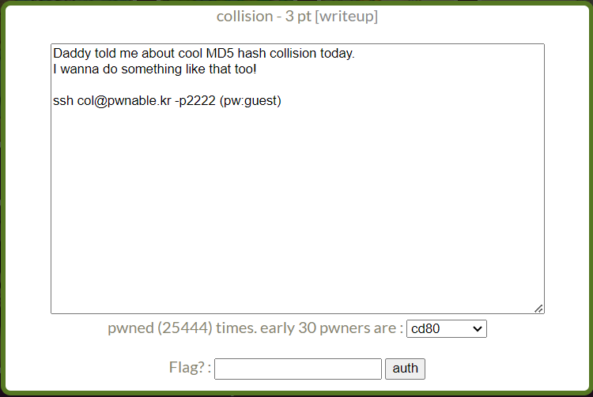
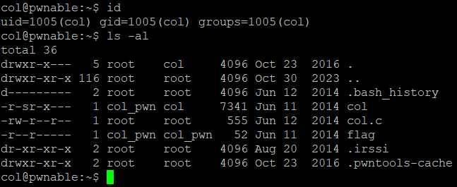
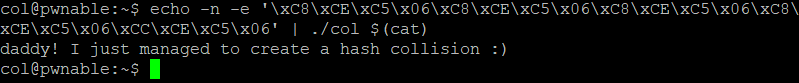

collision Solution
====================
- 문제


문제에서 MD5 충돌을 언급하고 있다. MD5는 임의의 입력 값을 128비트 길이의 해시값으로 암호화하는 알고리즘이다. MD5는 단방향 해시 알고리즘이므로 일반적으로 복호화가 불가하다. 하지만 2004년에 다른 두 파일이 같은 해시값을 갖는 해시 충돌이 발견되어 현재 보안용 알고리즘으로는 사용되지 않고 있다. collision 문제에서는 이와 같이 특정 입력 값을 이용해 원하는 해시값을 만들어 내는 과정을 요구하고 있다.

- id, 디렉터리


현재 내가 접속한 사용자는 col이고 col 그룹에 속해있다. 당연히 flag를 열람할 수 없으니 col의 실행과 col.c 내용 열람을 통해 flag를 얻어야 한다.

- col.c
```c
#include <stdio.h>
#include <string.h>
unsigned long hashcode = 0x21DD09EC;
unsigned long check_password(const char* p){
        int* ip = (int*)p;
        int i;
        int res=0;
        for(i=0; i<5; i++){
                res += ip[i];
        }
        return res;
}

int main(int argc, char* argv[]){
        if(argc<2){
                printf("usage : %s [passcode]\n", argv[0]);
                return 0;
        }
        if(strlen(argv[1]) != 20){
                printf("passcode length should be 20 bytes\n");
                return 0;
        }

        if(hashcode == check_password( argv[1] )){
                system("/bin/cat flag");
                return 0;
        }
        else
                printf("wrong passcode.\n");
        return 0;
}
```

col.c는 실행 인자로 받은 argv[1]을 check_password() 함수로 넘겨 받은 리턴 값이 hashcode(0x21DD09EC)와 같으면 col_pwn의 권한으로 /bin/cat flag를 실행한다. 따라서 flag를 얻기 위해서는 col에 적절한 입력을 주어 check_password()의 리턴 값이 0x21DD09EC가 되도록 해야한다.

check_password() 함수는 char형 포인터 p를 int형 포인터로 캐스팅 후 4*5 byte의 값을 더해 리턴하고 있다. 여기서 포인터의 타입 캐스팅이 중요하다. char형 포인터 p가 가리키는 값은 1 byte이다. 즉 p[n]의 값은 1 byte 정수이다. 여기서 p를 int형 포인터 ip로 캐스팅 한다면 ip가 가리키는 값은 4 byte의 정수이다. 예를 들어 p = 0x00000000 이고, 0x00000000 ~ 0x00000003 에 값이 순서대로 0x00, 0x01, 0x02, 0x03이 저장되어 있다면 p[0] == 0x00 이고, ip[0] == 0x03020100 이다. (현재 시스템이 little-endian 방식을 사용하기 때문)

이 점을 이용해 ip[0] + ip[1] + ... + ip[4] 의 값이 0x21DD09EC 가 되도록 입력을 주어야한다. 0x21DD09EC = 0x06C5CEC8 * 5 + 4 이므로 ip[0] ~ ip[3] 은 0x06C5CEC8, ip[4]는 0x06C5CEC8 + 4 = 0x06C5CECC가 되면 원하는 값을 얻을 수 있다. little-endian 방식을 고려해 입력의 첫 16바이트는 0xC8CEC506를 4번 반복하고 마지막 4바이트를 0xCCCEC506 로 전달하면 flag를 얻을 수 있다. 

echo와 파이프(|)를 이용해 일반적인 방법으로 입력하기 어려운 바이트를 입력으로 전달할 수 있다.



"daddy! I just ~ " 가 우리가 얻은 flag이다.