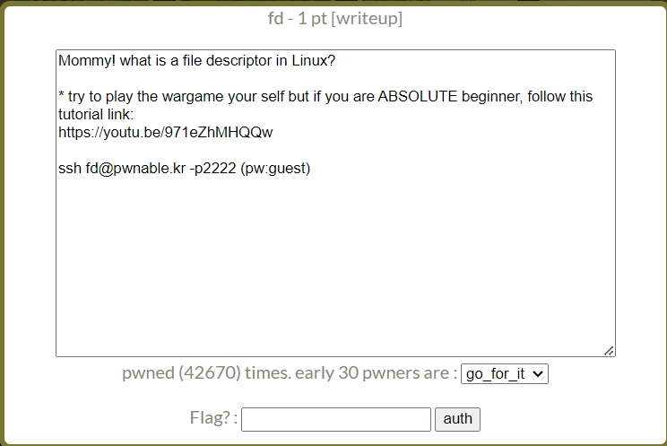
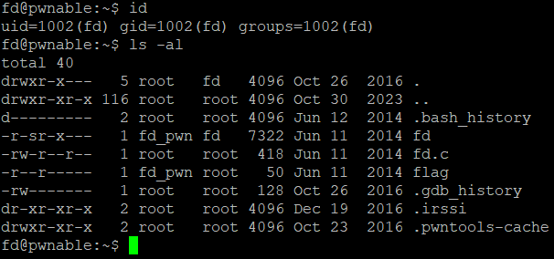
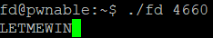
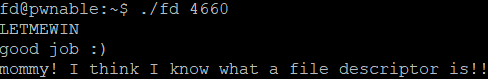

fd Solution
=============================
pwnable.kr의 첫번째 문제 fd이다. 



ssh로 fd@pwnable.kr 2222포트에 접속해 flag를 얻어야 한다.



현재 사용자인 fd는 fd 그룹에 속해있고, 현재 디렉토리에는 바이너리 fd, c 소스 파일 fd.c, 그리고 얻어야 하는 flag가 적혀있는 flag 파일이 있다. flag 파일은 현재 사용자, 그룹으로 읽을 수 없다. 현재 할 수 있는 것은 fd의 실행과 fd.c의 내용을 읽어보는 것뿐이므로 fd.c의 내용을 살펴본다.

 - fd.c
```c
#include <stdio.h>
#include <stdlib.h>
#include <string.h>
char buf[32];
int main(int argc, char* argv[], char* envp[]){
        if(argc<2){
                printf("pass argv[1] a number\n");
                return 0;
        }
        int fd = atoi( argv[1] ) - 0x1234;
        int len = 0;
        len = read(fd, buf, 32);
        if(!strcmp("LETMEWIN\n", buf)){
                printf("good job :)\n");
                system("/bin/cat flag");
                exit(0);
        }
        printf("learn about Linux file IO\n");
        return 0;

}
```

fd.c는 실행 시 받은 인자를 정수로 변환 후 0x1234 만큼 뺀 값을 file descriptor로 이용해 buf에 내용을 받아내고 있다. 이 때, buf의 내용이 "LETMEWIN\n"인 경우 /bin/cat flag를 실행해 flag의 내용을 얻을 수 있다. (여기서 /bin/cat flag가 실행될 수 있는 이유는 fd 파일의 소유자는 fd_pwn이고, fd의 실행 권한에 setuid가 설정되어 있기 때문에 소유자가 fd_pwn인 flag 파일의 내용을 읽을 수 있다.) 

즉, fd가 가리키는 파일의 내용이 "LETMEWIN\n"인 경우 flag를 얻을 수 있다. 하지만 우리는 현재 디렉터리에서 파일을 쓸 수 없고, 쓸 수 있다고 하더라도 해당 파일의 file descriptor 값은 리눅스 커널이 부여하기 때문에 현재 권한으로 알아낼 수 없다. 따라서 새로운 파일을 작성하는 것이 아닌 다른 방법을 사용해야 한다.

file descriptor에는 3개의 고정된 값이 존재한다. 0은 표준 입력, 1은 표준 출력, 2는 표준 오류 출력이다. 여기서 우리는 표준 입력을 이용해 buf에 원하는 내용을 입력할 것이다.



인자에 0x1234(=4660) 을 전달하면 fd 값은 0이 되어 read() 함수에서 표준 입력을 통해 buf에 값을 받을 것이다. 따라서 fd 4660을 실행 후 LETMEWIN와 엔터를 입력하면 성공적으로 /bin/cat flag가 실행되어 flag 값을 얻을 수 있다.



"mommy! I think ~ " 가 우리가 원하는 flag이다.