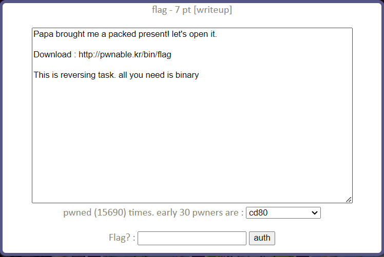
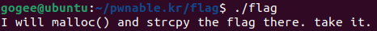
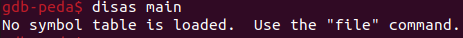
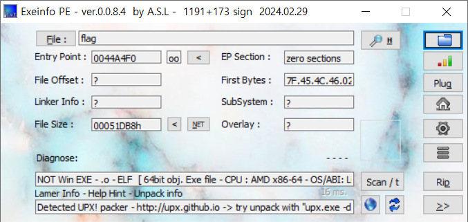
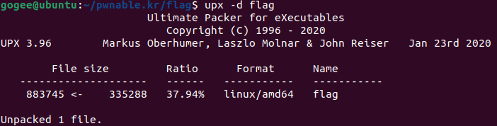
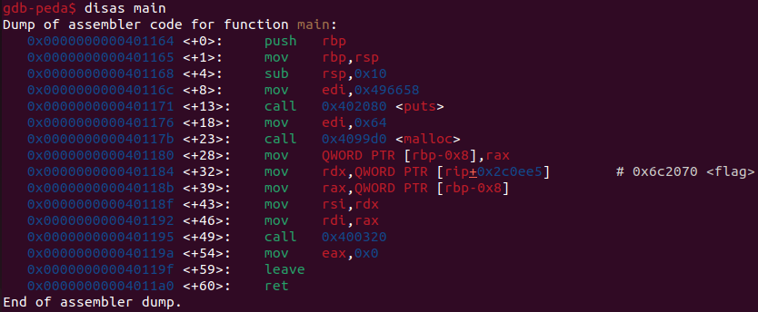
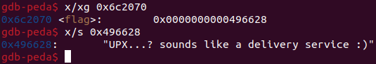

flag Solution
=======================



이번 문제는 리버싱을 통해 바이너리에 숨겨진 flag를 얻어야 한다. wget을 통해 제공된 바이너리를 다운로드한다.

```bash
$ wget http://pwnable.kr/bin/flag
```



flag 파일을 실행해 보면 위와 같은 힌트가 담긴 문자열이 출력된다. flag 바이너리에서 malloc()을 실행해 메모리를 할당하고 그 곳에 strcpy() 함수로 flag를 복사한다. 디버거를 통해 strcpy()의 인자로 전달되는 malloc()으로 할당된 힙 메모리 공간과 flag가 저장된 주소를 찾으면 flag를 얻을 수 있을 것이다.



힌트에서 malloc() 함수를 사용했다고 했으므로 이 바이너리는 C로 작성되었을 것이다. 따라서 main() 함수를 디스어셈블해 보았다. 그런데 심볼을 찾을 수 없다는 메시지와 함께 디스어셈블이 되지 않았다. 이 경우 바이너리가 암호화 되었거나 패킹이 되어있을 가능성이 있다. EXE, ELF 파일의 메타데이터 및 다른 정보들을 보여주는 Windows 어플리케이션인 EXEInfo를 사용해 해당 바이너리를 검사해보자.



검사 결과를 봤을 때 해당 바이너리는 ELF 파일이고, UPX packing이 감지되었다는 것을 알 수 있다. UPX는 널리 사용되는 오픈 소스 패킹 어플리케이션으로 단순 압축형 패킹이기 때문에 쉽게 언패킹 할 수 있다. upx 패커를 설치해 이 바이너리를 언패킹하자. 



이제 디버거의 디스어셈블이 성공적으로 작동할 것이다.



<+23>에서 0x64 byte만큼 malloc() 함수로 메모리를 할당하고 할당된 메모리 주소를 %rbp-0x8에 저장하고 있다. <+43>과 <+46>을 보면 %rdi에는 malloc() 함수로 할당한 메모리의 주소, %rsi에는 0x6c2070 주소에 저장된 값을 저장하고 0x400320을 호출하고 있다. 상황을 유추해 보았을 때 0x400320은 strcpy()이고, 0x6c2070에 저장된 값은 flag가 담긴 주소값일 것이다.



0x6c2070에는 0x496628이 저장되어 있고, 0x496628에는 "UPX...? sounds ..." 라는 문자열이 저장되어 있다. 이 문자열이 이번 문제의 flag이다.