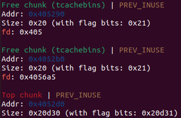

Heap 메모리 구조
=================

이 글은 현재 필자가 사용 중인 glibc-2.35 version 기준으로 작성되었습니다. [e_yejun 님의 블로그](https://she11.tistory.com/) 를 참고해 작성했습니다.

## Heap 영역 할당

아래의 C 프로그램을 이용해 malloc() 함수 호출 전과 호출 후 메모리 매핑 상태를 알아 보자.

```c
#include <stdio.h>
#include <stdlib.h>

int main()
{
    int *p;
    p = (int*)malloc(sizeof(int));
    return 0;
}
```

- malloc() 호출 전


- malloc() 호출 후


이를 통해 볼 수 있듯 malloc()을 사용해 할당한 메모리는 런타임에 heap 영역 메모리로부터 할당 되어 사용되는 것을 알 수 있다.

## Chunk 필드

Chunk는 메모리 할당을 위해 사용되는 구조체이다. 실제 사용되는 메모리 영역과 여러가지 메타데이터를 포함하는 자료구조이다. glibc-2.35 의 malloc.c 파일에 malloc_chunk 구조체의 정의가 있다.

- malloc_chunk 구조체

```c
struct malloc_chunk {

  INTERNAL_SIZE_T      mchunk_prev_size;  /* Size of previous chunk (if free).  */
  INTERNAL_SIZE_T      mchunk_size;       /* Size in bytes, including overhead. */

  struct malloc_chunk* fd;         /* double links -- used only if free. */
  struct malloc_chunk* bk;

  /* Only used for large blocks: pointer to next larger size.  */
  struct malloc_chunk* fd_nextsize; /* double links -- used only if free. */
  struct malloc_chunk* bk_nextsize;
};
```

이전 청크의 크기를 나타내는 mchunk_prev_size(이하 prev_size), 해당 청크의 크기를 나타내는 mchunk_size(이하 size), 해제된 청크의 경우에 사용되는 이전, 다음 청크 포인터인 fd, bk 그리고 크기가 큰 청크에만 사용되는 fd_nextsize, bk_nextsize 포인터로 구성되어 있다. malloc.c 1168 행부터 청크에 대한 자세한 설명이 적혀 있다.

```c
/*
    An allocated chunk looks like this:


    chunk-> +-+-+-+-+-+-+-+-+-+-+-+-+-+-+-+-+-+-+-+-+-+-+-+-+-+-+-+-+-+-+-+-+
	    |             Size of previous chunk, if unallocated (P clear)  |
	    +-+-+-+-+-+-+-+-+-+-+-+-+-+-+-+-+-+-+-+-+-+-+-+-+-+-+-+-+-+-+-+-+
	    |             Size of chunk, in bytes                     |A|M|P|
      mem-> +-+-+-+-+-+-+-+-+-+-+-+-+-+-+-+-+-+-+-+-+-+-+-+-+-+-+-+-+-+-+-+-+
	    |             User data starts here...                          .
	    .                                                               .
	    .             (malloc_usable_size() bytes)                      .
	    .                                                               |
nextchunk-> +-+-+-+-+-+-+-+-+-+-+-+-+-+-+-+-+-+-+-+-+-+-+-+-+-+-+-+-+-+-+-+-+
	    |             (size of chunk, but used for application data)    |
	    +-+-+-+-+-+-+-+-+-+-+-+-+-+-+-+-+-+-+-+-+-+-+-+-+-+-+-+-+-+-+-+-+
	    |             Size of next chunk, in bytes                |A|0|1|
	    +-+-+-+-+-+-+-+-+-+-+-+-+-+-+-+-+-+-+-+-+-+-+-+-+-+-+-+-+-+-+-+-+

    
    Free chunks are stored in circular doubly-linked lists, and look like this:

    chunk-> +-+-+-+-+-+-+-+-+-+-+-+-+-+-+-+-+-+-+-+-+-+-+-+-+-+-+-+-+-+-+-+-+
	    |             Size of previous chunk, if unallocated (P clear)  |
	    +-+-+-+-+-+-+-+-+-+-+-+-+-+-+-+-+-+-+-+-+-+-+-+-+-+-+-+-+-+-+-+-+
    `head:' |             Size of chunk, in bytes                     |A|0|P|
      mem-> +-+-+-+-+-+-+-+-+-+-+-+-+-+-+-+-+-+-+-+-+-+-+-+-+-+-+-+-+-+-+-+-+
	    |             Forward pointer to next chunk in list             |
	    +-+-+-+-+-+-+-+-+-+-+-+-+-+-+-+-+-+-+-+-+-+-+-+-+-+-+-+-+-+-+-+-+
	    |             Back pointer to previous chunk in list            |
	    +-+-+-+-+-+-+-+-+-+-+-+-+-+-+-+-+-+-+-+-+-+-+-+-+-+-+-+-+-+-+-+-+
	    |             Unused space (may be 0 bytes long)                .
	    .                                                               .
	    .                                                               |
nextchunk-> +-+-+-+-+-+-+-+-+-+-+-+-+-+-+-+-+-+-+-+-+-+-+-+-+-+-+-+-+-+-+-+-+
    `foot:' |             Size of chunk, in bytes                           |
	    +-+-+-+-+-+-+-+-+-+-+-+-+-+-+-+-+-+-+-+-+-+-+-+-+-+-+-+-+-+-+-+-+
	    |             Size of next chunk, in bytes                |A|0|0|
	    +-+-+-+-+-+-+-+-+-+-+-+-+-+-+-+-+-+-+-+-+-+-+-+-+-+-+-+-+-+-+-+-+
*/
```

위 주석은 할당된 청크와 해제된 청크의 구조에 대해 설명하고 있다. 여기서 'mem'이 실제로 사용되는 메모리 영역이고, malloc()을 호출했을 때 리턴하는 주소다. chunk size는 항상 two words의 배수이다. 32비트의 경우 1 word = 4 byte 이므로 chunk size는 8 byte의 배수, 64비트 시스템의 경우 1 word = 8 byte 이므로 chunk size는 16 byte의 배수가 된다. size의 하위 3비트는 필드 상황을 나타내는 flag bit(A, M, P bit)로 사용된다. 각자 무슨 역할을 하는지 알아 보자.

1. P (PREV_INUSE)

    - '이전' 청크의 할당 여부를 나타내는 비트. 이전 청크가 할당되어 있는 경우 set.
    - 첫 번째 청크는 항상 set. (존재하지 않는 메모리 참조를 막기 위해)
    - fastbins에 있는 청크의 경우 free 되어도 할당된 청크로 처리된다. 

2. M (IS_MAPPED)

    - mmap을 통해 할당된 청크이면 set.
    - M 비트가 설정된 경우 다른 비트들은 무시된다.

3. A (NON_MAIN_ARENA)

    - 청크가 초기 main arena에 위치하는 경우 clear.
    - thread가 생성되면 해당 thread는 각자의 arena를 갖는다. 청크가 thread arena에 있는 경우 set.

## Chunk 종류

청크의 종류에는 allocated chunk, freed chunk 그리고 힙 영역의 나머지 공간을 관리하는 top chunk가 있다. 아래 코드를 통해 chunk 종류별 구조를 살펴보자.

```c
#include<stdio.h>
#include<stdlib.h>
#include<string.h>

int main(){
	char *chunk1 = (char *) malloc(8);
	char *chunk2 = (char *) malloc(8);
	strcpy(chunk1, "HiHi");
	strcpy(chunk2, "ByeBye");
	free(chunk1)
	free(chunk2)
	return 0;
}
```

- Allocated chunk


(peda를 사용하다가 heap 관련 명령어 실행에 있어 pwndbg가 더 좋은 것 같아 변경했다.)

chunk1, chunk2를 malloc()으로 할당했을 때 청크 구조이다. 0x405290부터 0x20 byte (32 byte)가 chunk1, 0x4052b0부터 0x20 byte가 chunk2이다. 두 청크 모두 P bit가 설정되어 있으므로 size 필드의 값은 0x20+0x1 = 0x21이 된다. chunk1의 실제 데이터 영역은 0x4052a0이고, chunk2의 실제 데이터 영역은 0x4052c0이다. strcpy() 함수 실행 후의 메모리 상태를 보자.


각 청크의 데이터 영역에 문자열이 저장된 것을 확인할 수 있다.

- Freed chunk

이제 chunk1을 free 시킨 후의 구조를 살펴 보자. 


chunk1이 해제되어 tcachebin이 해당 청크를 관리하고 있다. 청크의 fd, bk 필드에 이전, 다음 청크 포인터가 저장되는데 현재 값이 비정상적이다. 이유는 잘 모르겠으나 아마 tcachebin으로 청크가 넘어가며 생긴 현상인 것 같다.




chunk2까지 해제한 상태의 메모리다. tcachebin이 chunk2도 관리하고 있다. 이번에도 fd, bk 포인터 값이 비정상적이다. 


LIFO 방식으로 해제된 메모리가 tcachebin에 쌓여 있는 것을 확인할 수 있다. bin에 관해서는 밑에서 알아 보도록 하자.

- Top chunk

Top chunk는 힙의 마지막 영역에 위치한다. 메모리를 할당할 때 bins를 확인하고 적당한 청크가 없다면 Top chunk에서 일부를 분리해 할당한다. 만약 Top chunk에서 가져온 청크가 해제되는 경우 다시 Top chunk에 병합될 수도 있다.


위는 chunk1만 할당했을 때 청크 상황이다. Top chunk의 size는 0x20d50이다. 현재 bin에 마땅한 청크가 없으므로 chunk2를 할당한다면 Top chunk에서 20 byte만큼 분리해 할당할 것이다.


chunk2 할당 후 Top chunk의 size가 이전에서 0x20 byte만큼 감소한 0x20d30이 된 것을 볼 수 있다.

## Bins

