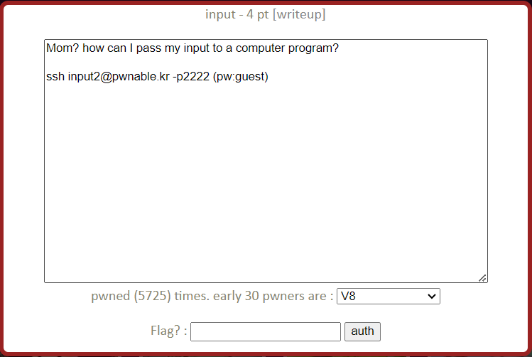
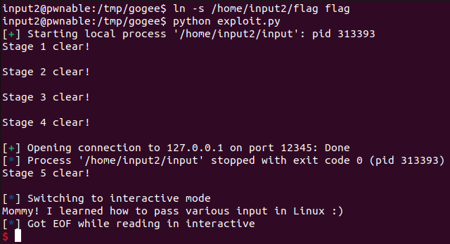

input Solution
===========================



이번 문제는 ssh를 통해 서버에 접속해 flag를 얻는 문제이다. 


사용자와 현재 디렉터리 정보다. 역시 input 실행 파일과 input.c 소스 코드 파일을 이용해 문제를 풀어야한다. 

- input.c (요약)

```c
#include <stdio.h>
#include <stdlib.h>
#include <string.h>
#include <sys/socket.h>
#include <arpa/inet.h>

int main(int argc, char* argv[], char* envp[]){
	printf("Welcome to pwnable.kr\n");
	printf("Let's see if you know how to give input to program\n");
	printf("Just give me correct inputs then you will get the flag :)\n");
	// argv
    ...
	printf("Stage 1 clear!\n");	
	// stdio
	...
	printf("Stage 2 clear!\n");
	// env
	...
	printf("Stage 3 clear!\n");
	// file
	...
	printf("Stage 4 clear!\n");	
	// network
	...
	printf("Stage 5 clear!\n");
	// here's your flag
	system("/bin/cat flag");	
	return 0;
}
```

이 문제는 사용자가 프로그램에 전달할 입력을 5개의 방식으로 제어하고 모든 방식에 대해 올바른 입력을 주면 /bin/cat flag 를 실행하도록 되어 있다. Stage 1부터 차례대로 살펴보도록 하자. 

    python의 pwntools를 사용하면 실행 인자, 환경 변수, 바이트 입력 등 편리한 기능을 통해 문제를 쉽게 풀 수 있다. 또, TCP 연결이 필요한 문제이기 때문에 터미널에서 직접 실행하며 실시간으로 데이터를 송수신 하기에는 어려움이 있다.(가능할 것 같긴 하다.) 따라서 python으로 작성한 exploit 코드를 사용하기로 한다.

    그런데 현재 디렉터리(/home/input2)에는 w 권한이 없으므로 파일 작성이 가능한 /tmp 디렉터리에서 코드를 작성한다. /tmp 는 임시 파일이 저장되는 디렉터리로 기본적으로 1777 권한이 부여된다. pwnable.kr의 /tmp 에는 1773 권한이 부여되어 있다.

```bash
$ mkdir /tmp/gogee
$ cd /tmp/gogee
$ vi exploit.py
```

-------------------------------

### Stage 1

```c
	// argv
	if(argc != 100) return 0;
	if(strcmp(argv['A'],"\x00")) return 0;
	if(strcmp(argv['B'],"\x20\x0a\x0d")) return 0;
	printf("Stage 1 clear!\n");	
```

Stage 1을 통과하기 위해서는 프로그램 실행 인자의 개수가 100개, 65번 째 인자가 "\x00", 66번 째 인자가 "\x20\x0a\x0d" 가 되어야 한다. pwntools의 process 객체를 생성할 때 argv 속성을 설정할 수 있다. 
```python
argv = 실행 인자로 들어갈 리스트
p = process(executable='실행 파일 경로', argv=argv)
```
이를 이용하면 쉽게 argv[65]와 argv[66]의 값을 조정해 프로그램의 실행 인자로 넘길 수 있다.

- Stage 1 exploit.py 

```python
from pwn import *

argv = ['a' for i in range(100)]
argv[65] = "\x00"
argv[66] = "\x20\x0a\x0d"

p = process(executable="/home/input2/input", argv=argv)
p.recvuntil(":)\n")
print(p.recvuntil("clear!\n"))
```

----------------------------

### Stage 2

```c
	// stdio
	char buf[4];
	read(0, buf, 4);
	if(memcmp(buf, "\x00\x0a\x00\xff", 4)) return 0;
	read(2, buf, 4);
    if(memcmp(buf, "\x00\x0a\x02\xff", 4)) return 0;
	printf("Stage 2 clear!\n");
```

Stage 2는 표준 입출력을 통해 입력을 전달해야한다. 표준 입력으로 "\x00\x0a\x00\xff"를, 표준 오류로 "\x00\x0a\x02\xff"를 주어야 스테이지를 통과할 수 있다. process 클래스의 send() 메서드로 표준 입력을, proc.stderr.write() 메서드로 표준 오류를 프로세스에 전달할 수 있다. 

- Stage 2 exploit.py

```python
from pwn import *

# ... Stage 1 생략 ...

p.send("\x00\x0a\x00\xff")
p.proc.stderr.write("\x00\x0a\x02\xff")
print(p.recvuntil("clear!\n"))
```

----------------------------------

### Stage 3

```c
	if(strcmp("\xca\xfe\xba\xbe", getenv("\xde\xad\xbe\xef"))) return 0;
	printf("Stage 3 clear!\n");
```

Stage 3는 프로그램에 전달된 환경변수 값을 검사한다. 주어진 환경변수는 main() 함수의 인자인 envp[]에 저장된다. 여기서는 환경 변수 "\xde\xad\xbe\xef"의 값이 "\xca\xfe\xba\xbe"와 같으면 스테이지를 통과할 수 있다. pwntools의 process 객체를 생성할 때 딕셔너리 형태로 환경 변수 이름과 값을 프로세스에 넘길 수 있다. 

- Stage 3 exploit.py

```python
from pwn import *

env = {"\xde\xad\xbe\xef" : "\xca\xfe\xba\xbe"}
p = process(executable='/home/input2/input', argv=argv, env=env)
```

위와 같이 env 속성에 딕셔너리를 전달해 프로그램의 환경 변수 값을 조정할 수 있다.

---------------------------------

### Stage 4

```c
	FILE* fp = fopen("\x0a", "r");
	if(!fp) return 0;
	if( fread(buf, 4, 1, fp)!=1 ) return 0;
	if( memcmp(buf, "\x00\x00\x00\x00", 4) ) return 0;
	fclose(fp);
	printf("Stage 4 clear!\n");	
```

Stage 4는 이름이 "\x0a"인 파일을 열고 4 byte를 읽은 내용이 "\x00\x00\x00\x00"과 같은지 비교한다. pwntools를 쓸 필요도 없이 간단히 통과할 수 있다.

- Stage 4 exploit.py

```python
file = open("\x0a", "w")
file.write("\x00\x00\x00\x00")
file.close()
```

---------------------------------

### Stage 5

```c
	int sd, cd;
	struct sockaddr_in saddr, caddr;
	sd = socket(AF_INET, SOCK_STREAM, 0);
	if(sd == -1){
		printf("socket error, tell admin\n");
		return 0;
	}
	saddr.sin_family = AF_INET;
	saddr.sin_addr.s_addr = INADDR_ANY;
	saddr.sin_port = htons( atoi(argv['C']) );
	if(bind(sd, (struct sockaddr*)&saddr, sizeof(saddr)) < 0){
		printf("bind error, use another port\n");
    		return 1;
	}
	listen(sd, 1);
	int c = sizeof(struct sockaddr_in);
	cd = accept(sd, (struct sockaddr *)&caddr, (socklen_t*)&c);
	if(cd < 0){
		printf("accept error, tell admin\n");
		return 0;
	}
	if( recv(cd, buf, 4, 0) != 4 ) return 0;
	if(memcmp(buf, "\xde\xad\xbe\xef", 4)) return 0;
	printf("Stage 5 clear!\n");
```

Stage 5는 소켓 프로그래밍으로 구현되어 있다. argv[67] 값을 port로 하는 TCP 연결을 구현하고 있다. 클라이언트로부터 4 byte의 값을 받아 "\xde\xad\xbe\xef"와 비교해 같으면 통과이다. 서버가 로컬에 열리는 것이므로 argv[67] 값만 임의로 조정해 해당 port로 로컬 연결을 하고 값을 전송하면 스테이지를 클리어 할 수 있다.

- Stage 5 exploit.py

```python
argv = ['a' for i in range(100)]
argv[67] = "12345"

r = remote('127.0.0.1', 12345)
sleep(3)
r.send("\xde\xad\xbe\xef")
sleep(2)
```

pwntools의 remote 객체를 생성해 로컬 서버와 연결 후 데이터를 전송했다. 통신 속도를 고려해 sleep() 함수로 딜레이를 추가하였다. 

-------------------------------------------

- 전체 exploit.py

```python
from pwn import *

argv = ['a' for i in range(100)]
argv[65] = "\x00"
argv[66] = "\x20\x0a\x0d"
argv[67] = "12345" # port

env = {"\xde\xad\xbe\xef" : "\xca\xfe\xba\xbe"}

file = open("\x0a", "w")
file.write("\x00\x00\x00\x00")
file.close()

p = process(executable='/home/input2/input', argv=argv, env=env)
p.recvuntil(":)\n")
print(p.recvuntil("clear!\n"))

p.send("\x00\x0a\x00\xff")
p.proc.stderr.write("\x00\x0a\x02\xff")

print(p.recvuntil("clear!\n"))
print(p.recvuntil("clear!\n"))
print(p.recvuntil("clear!\n"))

r = remote('127.0.0.1', 12345)
sleep(3)
r.send("\xde\xad\xbe\xef")
sleep(2)

print(p.recvuntil("clear!\n"))

p.interactive()
```

현재 작업중인 디렉터리에는 flag 파일이 없으므로 /home/input2/flag 의 심볼릭 링크를 생성해 /bin/cat flag가 정상적으로 실행되도록 했다.
 
- 결과 



"Moomy! I learned ..."가 이번 문제의 flag이다.