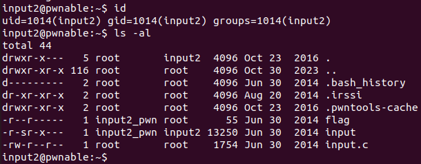

input Solution
===========================


이번 문제는 ssh를 통해 서버에 접속해 flag를 얻는 문제이다. 



사용자와 현재 디렉터리 정보다. 역시 input 실행 파일과 input.c 소스 코드 파일을 이용해 문제를 풀어야한다. 

- input.c (요약)

```c
#include <stdio.h>
#include <stdlib.h>
#include <string.h>
#include <sys/socket.h>
#include <arpa/inet.h>

int main(int argc, char* argv[], char* envp[]){
	printf("Welcome to pwnable.kr\n");
	printf("Let's see if you know how to give input to program\n");
	printf("Just give me correct inputs then you will get the flag :)\n");
	// argv
    ...
	printf("Stage 1 clear!\n");	
	// stdio
	...
	printf("Stage 2 clear!\n");
	// env
	...
	printf("Stage 3 clear!\n");
	// file
	...
	printf("Stage 4 clear!\n");	
	// network
	...
	printf("Stage 5 clear!\n");
	// here's your flag
	system("/bin/cat flag");	
	return 0;
}
```

이 문제는 사용자가 프로그램에 전달할 입력을 5개의 방식으로 제어하고 모든 방식에 대해 올바른 입력을 주면 /bin/cat flag 를 실행하도록 되어 있다. Stage 1부터 차례대로 살펴보도록 하자. 

    python의 pwntools를 사용하면 실행 인자, 환경 변수, 바이트 입력 등 편리한 기능을 통해 문제를 쉽게 풀 수 있다. 또, TCP 연결이 필요한 문제이기 때문에 터미널에서 직접 실행하며 실시간으로 데이터를 송수신 하기에는 어려움이 있다.(가능할 것 같긴 하다.) 따라서 python으로 작성한 exploit 코드를 사용하기로 한다.

    그런데 현재 디렉터리(/home/input2)에는 w 권한이 없으므로 파일 작성이 가능한 /tmp 디렉터리에서 코드를 작성한다. /tmp 는 임시 파일이 저장되는 디렉터리로 기본적으로 1777 권한이 부여된다. pwnable.kr의 /tmp 에는 1773 권한이 부여되어 있다.

```bash
$ mkdir /tmp/gogee
$ cd /tmp/gogee
$ vi exploit.py
```

-------------------------------

### Stage 1

```c
	// argv
	if(argc != 100) return 0;
	if(strcmp(argv['A'],"\x00")) return 0;
	if(strcmp(argv['B'],"\x20\x0a\x0d")) return 0;
	printf("Stage 1 clear!\n");	
```

Stage 1을 통과하기 위해서는 프로그램 실행 인자의 개수가 100개, 65번 째 인자가 "\x00", 66번 째 인자가 "\x20\x0a\x0d" 가 되어야 한다. pwntools의 process 객체를 생성할 때 argv 속성을 설정할 수 있다. 
```python
argv = 실행 인자로 들어갈 리스트
p = process(executable='실행 파일 경로', argv=argv)
```
이를 이용하면 쉽게 argv[65]와 argv[66]의 값을 조정해 프로그램의 실행 인자로 넘길 수 있다.

- Stage 1 exploit.py 

```python
from pwn import *

argv = ['a' for i in range(100)]
argv[65] = "\x00"
argv[66] = "\x20\x0a\x0d"

p = process(executable="/home/input2/input", argv=argv)
p.recvuntil(":)\n")
print(p.recvuntil("clear!\n"))
```

