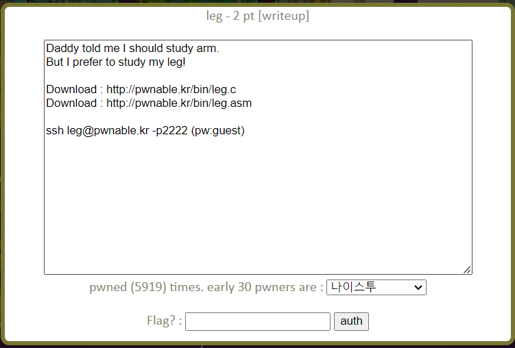
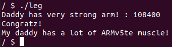

leg Solution
===========================



이번 문제는 주어진 leg.c와 leg.asm을 분석하고 leg@pwnable.kr의 leg 실행 파일을 실행해 flag를 얻어야 한다.

- leg.c

```c
#include <stdio.h>
#include <fcntl.h>
int key1(){
	asm("mov r3, pc\n");
}
int key2(){
	asm(
	"push	{r6}\n"
	"add	r6, pc, $1\n"
	"bx	r6\n"
	".code   16\n"
	"mov	r3, pc\n"
	"add	r3, $0x4\n"
	"push	{r3}\n"
	"pop	{pc}\n"
	".code	32\n"
	"pop	{r6}\n"
	);
}
int key3(){
	asm("mov r3, lr\n");
}
int main(){
	int key=0;
	printf("Daddy has very strong arm! : ");
	scanf("%d", &key);
	if( (key1()+key2()+key3()) == key ){
		printf("Congratz!\n");
		int fd = open("flag", O_RDONLY);
		char buf[100];
		int r = read(fd, buf, 100);
		write(0, buf, r);
	}
	else{
		printf("I have strong leg :P\n");
	}
	return 0;
}
```

leg.c는 사용자로부터 4 byte 정수 값을 입력받아 key1()+key2()+key3() 값과 같으면 flag를 읽어준다. 각각의 key 함수는 ARM 어셈블리로 작성되어 있다. leg.asm을 보며 각각 key 함수가 어떤 값을 리턴하는지 살펴보자.

- asm code for key1

```asm
Dump of assembler code for function key1:
   0x00008cd4 <+0>:	push	{r11}		; (str r11, [sp, #-4]!)
   0x00008cd8 <+4>:	add	r11, sp, #0
   0x00008cdc <+8>:	mov	r3, pc
   0x00008ce0 <+12>:	mov	r0, r3
   0x00008ce4 <+16>:	sub	sp, r11, #0
   0x00008ce8 <+20>:	pop	{r11}		; (ldr r11, [sp], #4)
   0x00008cec <+24>:	bx	lr
```

ARM 어셈블리는 r0 레지스터에 함수 리턴 값을 저장한다. 즉 bx lr 명령어 실행 전 r0 값이 함수의 리턴 값이 된다. <+12>에서 r3 값을 r0에 저장하고 있으므로 r3 값을 조사해보자. <+8>에서 pc 레지스터 값을 r3 레지스터에 저장한다. pc 레지스터는 program counter 레지스터로 ARM에서는 현재 실행 중인 라인의 다다음 라인의 시작 주소를 저장하고 있다. 따라서 <+8>의 pc 레지스터 값은 0x8ce4이다. 

- asm code for key2

```asm
Dump of assembler code for function key2:
   0x00008cf0 <+0>:	push	{r11}		; (str r11, [sp, #-4]!)
   0x00008cf4 <+4>:	add	r11, sp, #0
   0x00008cf8 <+8>:	push	{r6}		; (str r6, [sp, #-4]!)
   0x00008cfc <+12>:	add	r6, pc, #1
   0x00008d00 <+16>:	bx	r6
   0x00008d04 <+20>:	mov	r3, pc
   0x00008d06 <+22>:	adds	r3, #4
   0x00008d08 <+24>:	push	{r3}
   0x00008d0a <+26>:	pop	{pc}
   0x00008d0c <+28>:	pop	{r6}		; (ldr r6, [sp], #4)
   0x00008d10 <+32>:	mov	r0, r3
   0x00008d14 <+36>:	sub	sp, r11, #0
   0x00008d18 <+40>:	pop	{r11}		; (ldr r11, [sp], #4)
   0x00008d1c <+44>:	bx	lr
```

key2() 함수에서도 r0에 r3의 값을 저장하고 있다. <+20>에서 r3에 pc 값인 0x8d08을 저장한다. 이후 r3 값에 4를 더해 0x8d0c 값을 갖는다. 

- asm code for key3

```asm
Dump of assembler code for function key3:
   0x00008d20 <+0>:	push	{r11}		; (str r11, [sp, #-4]!)
   0x00008d24 <+4>:	add	r11, sp, #0
   0x00008d28 <+8>:	mov	r3, lr
   0x00008d2c <+12>:	mov	r0, r3
   0x00008d30 <+16>:	sub	sp, r11, #0
   0x00008d34 <+20>:	pop	{r11}		; (ldr r11, [sp], #4)
   0x00008d38 <+24>:	bx	lr
```

<+12>에서 r0에 r3 값을 저장하고 <+8> 에서 r3에 리턴 주소를 갖고 있는 lr 레지스터 값을 저장한다. lr 값을 확인하기 위해 main() 함수의 어셈블리 코드 일부를 살펴보자.

- asm code for main

```asm
   0x00008d7c <+64>:	bl	0x8d20 <key3>
   0x00008d80 <+68>:	mov	r3, r0
```

main()의 <+64>에서 key3() 함수를 호출하고 있다. 그 다음 라인인 0x8d80이 리턴 주소 값이 되므로 key3의 리턴 값은 0x8d80이 된다. 

따라서 0x8ce4 + 0x8d0c + 0x8d80 = 0x1a770 (십진수로 108400) 을 입력하면 flag를 얻을 수 있다.



"My daddy ..." 가 이번 문제의 flag이다.