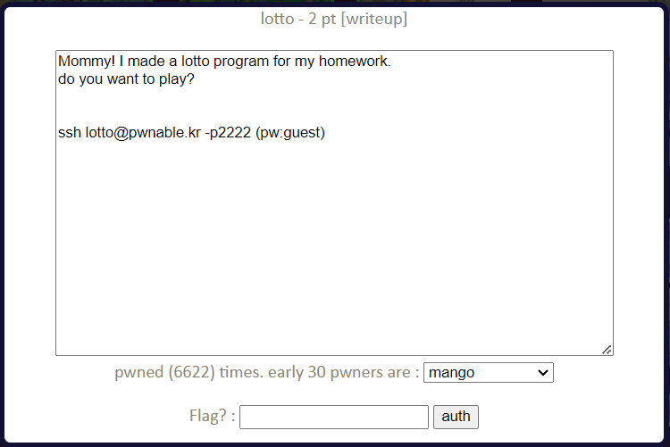

lotto Solution
====================



복권(로또) 프로그램을 만들었다고 한다. ssh로 서버에 접속해 확인해보자.


현재 사용자와 디렉터리 정보다. 다른 문제와 마찬가지로 lotto와 lotto.c 소스 코드 파일을 이용해 flag를 얻어야 한다. lotto.c 소스 코드 파일을 보자.

- lotto.c

```c
#include <stdio.h>
#include <stdlib.h>
#include <string.h>
#include <fcntl.h>

unsigned char submit[6];

void play(){
	
	int i;
	printf("Submit your 6 lotto bytes : ");
	fflush(stdout);

	int r;
	r = read(0, submit, 6);

	printf("Lotto Start!\n");
	//sleep(1);

	// generate lotto numbers
	int fd = open("/dev/urandom", O_RDONLY);
	if(fd==-1){
		printf("error. tell admin\n");
		exit(-1);
	}
	unsigned char lotto[6];
	if(read(fd, lotto, 6) != 6){
		printf("error2. tell admin\n");
		exit(-1);
	}
	for(i=0; i<6; i++){
		lotto[i] = (lotto[i] % 45) + 1;		// 1 ~ 45
	}
	close(fd);
	
	// calculate lotto score
	int match = 0, j = 0;
	for(i=0; i<6; i++){
		for(j=0; j<6; j++){
			if(lotto[i] == submit[j]){
				match++;
			}
		}
	}

	// win!
	if(match == 6){
		system("/bin/cat flag");
	}
	else{
		printf("bad luck...\n");
	}

}

void help(){
	printf("- nLotto Rule -\n");
	printf("nlotto is consisted with 6 random natural numbers less than 46\n");
	printf("your goal is to match lotto numbers as many as you can\n");
	printf("if you win lottery for *1st place*, you will get reward\n");
	printf("for more details, follow the link below\n");
	printf("http://www.nlotto.co.kr/counsel.do?method=playerGuide#buying_guide01\n\n");
	printf("mathematical chance to win this game is known to be 1/8145060.\n");
}

int main(int argc, char* argv[]){

	// menu
	unsigned int menu;

	while(1){

		printf("- Select Menu -\n");
		printf("1. Play Lotto\n");
		printf("2. Help\n");
		printf("3. Exit\n");

		scanf("%d", &menu);

		switch(menu){
			case 1:
				play();
				break;
			case 2:
				help();
				break;
			case 3:
				printf("bye\n");
				return 0;
			default:
				printf("invalid menu\n");
				break;
		}
	}
	return 0;
}
```

help() 함수를 보면 이 복권 프로그램의 룰은 일반적으로 알고 있는 한국식 로또의 룰과 동일하다. play() 함수에서 read() 함수를 이용해 표준 입력으로부터 6 byte를 submit 배열에 저장하고, /dev/urandom 파일을 읽어 생성된 난수 6 byte를 1 ~ 45 값을 갖도록 한 후 lotto 배열에 저장한다. /dev/urandom 파일은 암호학적으로 안전하다고 알려진 의사 난수 생성기이다. 조사해보니 /dev/urandom 에 취약점은 없는 것 같다. 따라서 lotto 배열의 값을 임의로 조작할 수는 없다. 이외에 BOF와 같은 취약점도 존재하지 않는다. 

문제는 입력된 값과 당첨 번호의 값을 비교하는 부분에서 발생한다.

```c
	int match = 0, j = 0;
	for(i=0; i<6; i++){
		for(j=0; j<6; j++){
			if(lotto[i] == submit[j]){
				match++;
			}
		}
	}
```

match의 값이 6인 경우 /bin/cat flag를 실행하는데, 복권 번호를 1 byte 씩 확인하는 부분에서 반복문을 잘못 사용하고 있다. 입력한 복권 번호 한 개가 위치 상관 없이 lotto 배열의 원소로 들어있다면 match 값은 6이 되어 flag를 얻을 수 있다. (정확히 1개가 일치해야 한다. 6개의 입력을 모두 같은 값으로 입력하는게 좋겠다.) 위치와 관계 없이 1개의 숫자만 맞추면 되므로 높은 확률로 성공할 수 있다. 나는 공백(32) 6개를 입력했다.


"sorry mom... I FORGOT ..." 가 이번 문제의 flag이다. 