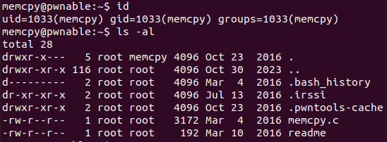

memcpy Solution
====================


memcpy 성능에 관한 실험을 도와주면 플래그를 얻을 수 있다고 한다. 서버에 접속해 보자.



현재 사용자와 디렉터리 정보다. 이번에는 실행 파일 바이너리와 flag가 없고 대신 readme 파일과 memcpy.c 소스 코드 파일만 제공되었다. readme 파일의 내용을 보자.

```bash
memcpy@pwnable:~$ cat readme 
the compiled binary of "memcpy.c" source code (with real flag) will be executed under memcpy_pwn privilege if you connect to port 9022.
execute the binary by connecting to daemon(nc 0 9022).
```

9022 포트로 접속하면 memcpy.c의 컴파일된 바이너리가 실행된다고 한다. 