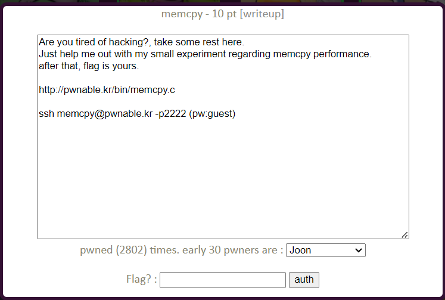
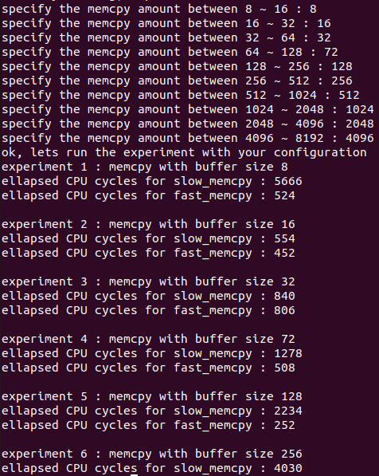

memcpy Solution
====================



memcpy 성능에 관한 실험을 도와주면 플래그를 얻을 수 있다고 한다. 서버에 접속해 보자.


현재 사용자와 디렉터리 정보다. 이번에는 실행 파일 바이너리와 flag가 없고 대신 readme 파일과 memcpy.c 소스 코드 파일만 제공되었다. readme 파일의 내용을 보자.

```bash
memcpy@pwnable:~$ cat readme 
the compiled binary of "memcpy.c" source code (with real flag) will be executed under memcpy_pwn privilege if you connect to port 9022.
execute the binary by connecting to daemon(nc 0 9022).
```

9022 포트로 접속하면 memcpy.c의 컴파일된 바이너리가 실행된다고 한다. 먼저 소스 코드를 살펴보자.

- memcpy.c

```c
char* slow_memcpy(char* dest, const char* src, size_t len){
	int i;
	for (i=0; i<len; i++) {
		dest[i] = src[i];
	}
	return dest;
}

char* fast_memcpy(char* dest, const char* src, size_t len){
	size_t i;
	// 64-byte block fast copy
	if(len >= 64){
		i = len / 64;
		len &= (64-1);
		while(i-- > 0){
			__asm__ __volatile__ (
			"movdqa (%0), %%xmm0\n"
			"movdqa 16(%0), %%xmm1\n"
			"movdqa 32(%0), %%xmm2\n"
			"movdqa 48(%0), %%xmm3\n"
			"movntps %%xmm0, (%1)\n"
			"movntps %%xmm1, 16(%1)\n"
			"movntps %%xmm2, 32(%1)\n"
			"movntps %%xmm3, 48(%1)\n"
			::"r"(src),"r"(dest):"memory");
			dest += 64;
			src += 64;
		}
	}
	// byte-to-byte slow copy
	if(len) slow_memcpy(dest, src, len);
	return dest;
}
```

memcpy.c 코드의 일부다. 8 ~ 16 바이트, 16 ~ 32 바이트, ..., 4096 ~ 8192 바이트 사이의 길이 값을 입력 받아 해당 길이만큼 slow_memcpy(), fast_memcpy()를 실행한다. 실행시 CPU 사이클을 비교해 두 memcpy 알고리즘의 시간 효율성을 따져보는 실험이다. slow_memcpy()는 한 바이트씩 데이터를 복사한다. fast_memcpy()는 64 바이트 블록 단위로 끊어 데이터 복사 후 남는 데이터는 slow_memcpy()로 한 바이트씩 복사한다. 서버에 접속해 각 실험마다 가장 작은 길이 값을 입력한 결과를 보자.


실험5(길이 128)의 fast_memcpy() 실행 중 프로그램이 종료된다. fast_memcpy()에 문제가 있는 것 같다. 실험 1 ~ 3은 두 memcpy() 모두 한 바이트씩 복사하기 때문에 문제가 없을 것이다. fast_memcpy()에 무슨 문제가 있는 건지 복사 알고리즘을 살펴봤다.

`movdqa` 명령어의 피연산자는 모두 16바이트 정렬이 되어있어야 한다는 것을 알아냈다. 실험 5에서 프로그램이 종료됐으므로 동적 할당된 128 바이트의 메모리 주소 값이 16바이트 정렬이 아닌 8바이트 정렬일 가능성이 높다. 이는 이전 할당에 의한 일이기 때문에 실험 4의 버퍼 길이 값을 64 + 8 = 72로 입력했다.



실험 5가 무사히 실행되었다. 이번엔 실험 6의 fast_memcpy()에서 실행이 종료 되었으므로 실험 5의 길이 값을 8 늘려 보았다. 이를 반복해 실험 10까지 모두 통과하면 플래그를 얻을 수 있다.


이번 문제의 flag는 "1_w4nn4_ ..." 이다.

왜 8바이트 정렬이 되었는지 생각해보면, 이 바이너리는 32 bit로 실행되므로 힙 청크 정렬이 8바이트가 된다. 따라서 64 byte의 메모리를 동적 할당하면 prev_size, size 필드가 8 바이트 추가되어 72 byte의 청크 크기를 갖게 된다. 즉 메모리가 8 바이트 정렬이 될 수 있다는 것이다. 여기서 만약 72 byte를 할당한다면 총 80 byte의 청크가 되어 16 바이트 정렬이 된다. 