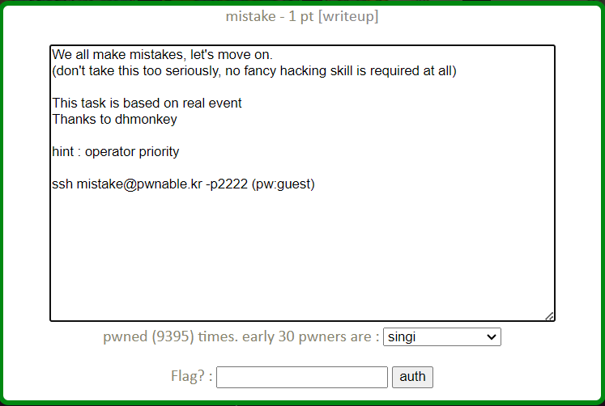
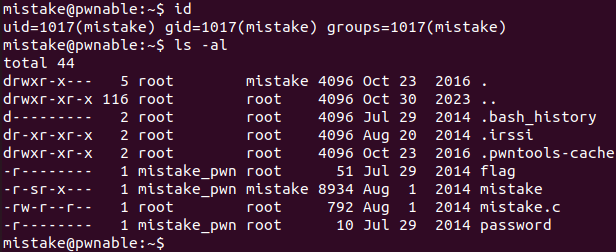
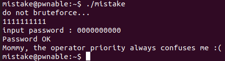

mistake Solution
======================



이번 문제는 연산자 우선순위와 관련된 실수에서 비롯된 버그를 이용해 flag를 얻는 문제이다. ssh로 접속해 살펴보자.



현재 사용자와 디렉터리 정보는 위와 같다. mistake 실행 파일과 mistake.c 소스 코드 파일을 이용해 문제를 풀어야 한다. mistake.c 의 내용을 살펴보자.

- mistake.c

```c
#include <stdio.h>
#include <fcntl.h>

#define PW_LEN 10
#define XORKEY 1

void xor(char* s, int len){
	int i;
	for(i=0; i<len; i++){
		s[i] ^= XORKEY;
	}
}

int main(int argc, char* argv[]){
	
	int fd;
	if(fd=open("/home/mistake/password",O_RDONLY,0400) < 0){
		printf("can't open password %d\n", fd);
		return 0;
	}

	printf("do not bruteforce...\n");
	sleep(time(0)%20);

	char pw_buf[PW_LEN+1];
	int len;
	if(!(len=read(fd,pw_buf,PW_LEN) > 0)){
		printf("read error\n");
		close(fd);
		return 0;		
	}

	char pw_buf2[PW_LEN+1];
	printf("input password : ");
	scanf("%10s", pw_buf2);

	// xor your input
	xor(pw_buf2, 10);

	if(!strncmp(pw_buf, pw_buf2, PW_LEN)){
		printf("Password OK\n");
		system("/bin/cat flag\n");
	}
	else{
		printf("Wrong Password\n");
	}

	close(fd);
	return 0;
}
```

mistake.c는 현재 디렉터리(/home/mistake)에 있는 password 파일을 열고 10 byte의 내용을 읽어 pw_buf에 저장 후 사용자로부터 받은 입력을 pw_buf2에 저장한다. pw_buf2의 각 문자를 1과 XOR 연산 후의 값으로 바꾸어 pw_buf와 pw_buf2의 내용이 같다면 /bin/cat flag를 실행해준다. 

문제의 힌트로 연산자 우선순위(operator priority)가 주어졌다. 실제로 mistake를 실행해보면 "do not bruteforce..." 문자열 출력 이후 20초 이상을 기다려도 "input password : " 문자열이 출력되지 않는다. 그렇다고 "read error"가 출력되지도 않는다. 그렇다는 것은 최대 19초의 sleep() 이후 read() 함수에서 입력 대기가 걸려있다고 유추해 볼 수 있다. 어떤 연산자 우선순위의 문제가 있었던 걸까?

```c
	if(fd=open("/home/mistake/password",O_RDONLY,0400) < 0){
		printf("can't open password %d\n", fd);
		return 0;
	}
```

문제는 여기 if문의 조건에서 발생한다. 개발자는 = 연산자 우선순위가 비교 연산자 우선순위보다 낮다는 사실을 간과하고 있었다. 'open(...) < 0' 부분의 연산이 먼저 수행되어 파일이 정상적으로 열렸을 경우 open() 의 값은 음수가 되지 않으므로 해당 부분의 값이 0이 된다. 이후 'fd = 0' 연산이 수행되어 fd 값에 0이 저장되고 조건에 해당하는 부분의 값이 결국 0이 되어 if문 안의 내용은 실행되지 않는다. 정리하면, 해당 부분에서 프로그램의 종료 없이 fd 값이 0으로 설정된다는 것이다.

이후 read()를 사용하는 if문도 같은 실수가 있었지만 정상적으로 read()가 실행되었다면 문제없이 통과할 수 있다. 이 때 fd 값이 0이므로 표준 입력으로부터 10 byte의 값을 입력 받아 pw_buf에 저장한다. 즉 pw_buf의 값을 사용자 마음대로 설정할 수 있게 된 것이다.

이제 mistake를 실행하고 "do not bruteforce..." 문자열 출력 후 20초 정도를 기다린 후 '1'을 10개 입력한다. '1'의 ASCII 값은 0x31이고 0x1과 XOR 연산한 값은 0x30, 즉 '0'이다. "input password : " 문자열이 출력된 이후 '0'을 10개 입력하면 flag를 얻을 수 있다.



"Mommy, the ..." 가 이번 문제의 flag이다.