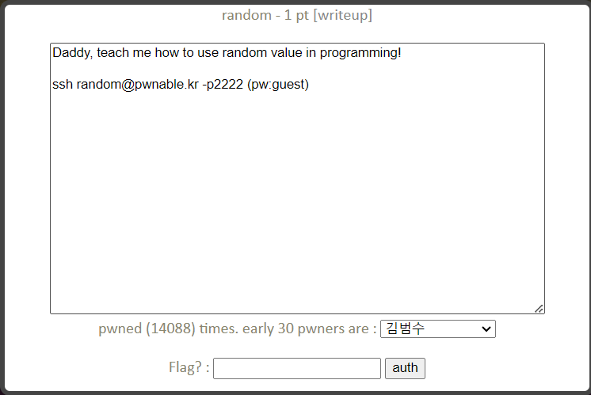
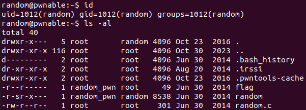
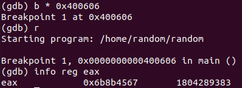
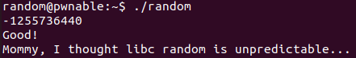

random Solution
======================



이번 문제도 ssh를 통해 접속해 flag를 얻는 문제이다.



사용자 정보와 디렉터리는 위와 같다. random 실행 파일과 random.c 소스 코드 파일을 이용해 flag를 얻어본다.

- random.c

```c
#include <stdio.h>

int main(){
	unsigned int random;
	random = rand();	// random value!

	unsigned int key=0;
	scanf("%d", &key);

	if( (key ^ random) == 0xdeadbeef ){
		printf("Good!\n");
		system("/bin/cat flag");
		return 0;
	}

	printf("Wrong, maybe you should try 2^32 cases.\n");
	return 0;
}
```

random.c 에서 random 변수에 rand() 함수를 사용해 난수를 저장하고 사용자로부터 받은 정수 입력을 key에 저장해 key와 random의 비트 XOR 연산 결과가 0xdeadbeef인 경우 /bin/cat flag를 실행한다. 여기서 rand() 함수의 seed를 정해주지 않고 함수를 사용하고 있는데, 이 경우 항상 같은 값이 출력된다. 따라서 디버깅을 통해 random 변수의 값을 얻어내고 그 값과 0xdeadbeef를 XOR 연산한 값을 입력하면 문제가 풀린다.

- asm code for main()

```assembly
Dump of assembler code for function main:
   0x00000000004005f4 <+0>:	push   %rbp
   0x00000000004005f5 <+1>:	mov    %rsp,%rbp
   0x00000000004005f8 <+4>:	sub    $0x10,%rsp
   0x00000000004005fc <+8>:	mov    $0x0,%eax
   0x0000000000400601 <+13>:	callq  0x400500 <rand@plt>
   0x0000000000400606 <+18>:	mov    %eax,-0x4(%rbp)
   0x0000000000400609 <+21>:	movl   $0x0,-0x8(%rbp)
   0x0000000000400610 <+28>:	mov    $0x400760,%eax
   0x0000000000400615 <+33>:	lea    -0x8(%rbp),%rdx
   0x0000000000400619 <+37>:	mov    %rdx,%rsi
   0x000000000040061c <+40>:	mov    %rax,%rdi
   0x000000000040061f <+43>:	mov    $0x0,%eax
   0x0000000000400624 <+48>:	callq  0x4004f0 <__isoc99_scanf@plt>
   0x0000000000400629 <+53>:	mov    -0x8(%rbp),%eax
   0x000000000040062c <+56>:	xor    -0x4(%rbp),%eax
   0x000000000040062f <+59>:	cmp    $0xdeadbeef,%eax
   0x0000000000400634 <+64>:	jne    0x400656 <main+98>
   0x0000000000400636 <+66>:	mov    $0x400763,%edi
   0x000000000040063b <+71>:	callq  0x4004c0 <puts@plt>
   0x0000000000400640 <+76>:	mov    $0x400769,%edi
   0x0000000000400645 <+81>:	mov    $0x0,%eax
   0x000000000040064a <+86>:	callq  0x4004d0 <system@plt>
   0x000000000040064f <+91>:	mov    $0x0,%eax
   0x0000000000400654 <+96>:	jmp    0x400665 <main+113>
   0x0000000000400656 <+98>:	mov    $0x400778,%edi
   0x000000000040065b <+103>:	callq  0x4004c0 <puts@plt>
   0x0000000000400660 <+108>:	mov    $0x0,%eax
   0x0000000000400665 <+113>:	leaveq 
   0x0000000000400666 <+114>:	retq 
```

main()을 디스어셈블 해보면 <+13>에서 rand() 함수를 호출하고 얻은 결과 값인 %eax를 %rbp-0x4 번지에 저장하고 있다. <+18>에 중단점을 설정하고 %eax 값을 구해본다.



random 변수의 값은 0x6b8b4567이다. 0x6b8b4567을 0xdeadbeef와 XOR 연산한 값은 -1255736440이다. (key는 unsigned int 형이므로 해당 값을 입력하면 3039230856으로 해석된다.) 프로그램을 실행해 이 값을 입력하면 flag를 얻을 수 있다.



"Mommy, I thought ..."이 이번 문제의 flag이다.