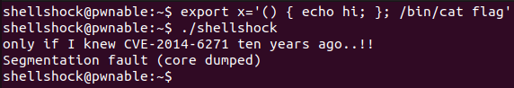

shellshock Solution
========================


이번 문제는 GNU bash의 Shellshock 취약점에 관련된 문제이다. ssh를 통해 접속해 확인해보자.


현재 사용자와 디렉터리 정보이다. 현재 권한으로 실행 가능한 bash, shellshock 파일과 열람 가능한 shellshock.c 소스 코드 파일이 있다. shellshock.c의 내용을 살펴보자.

- shellshock.c

```c
#include <stdio.h>
int main(){
	setresuid(getegid(), getegid(), getegid());
	setresgid(getegid(), getegid(), getegid());
	system("/home/shellshock/bash -c 'echo shock_me'");
	return 0;
}
```

내용은 매우 간단하다. ruid, euid, suid, rgid, egid, sgid를 모두 현재의 egid로 설정 후 /home/shellshock/bash를 실행해 'echo shock_me' 명령어를 실행한다. shellshock 파일은 그룹(shellshock_pwn) 실행 권한에 setuid bit가 설정되어 있다. 따라서 shellshock을 실행했을 때 egid는 shellshock_pwn의 gid인 1020이 된다.(id shellshock_pwn 명령어로 확인해 본 결과 1020 이었다.) /home/shellshock/bash를 1020의 권한으로 실행하게 되는 것이다. 여기서 Shellshock 취약점을 사용하게 되는데, 해당 취약점에 대해 자세히 알아보았다.

---------------------------------

### Shellshock 취약점 (CVE-2014-6271)

Shellshock 취약점은 GNU bash 4.3 이전 버전에서 40년 이상 방치된 심각한 취약점이다. bash shell의 환경 변수 선언과 자식 shell에서의 환경 변수 파싱 및 실행에 관련해 취약점이 발생했다. 환경 변수로 bash 함수를 선언할 수 있는데, 이 때 함수 뒤에 임의의 명령어를 추가하면 자식 shell이 실행될 때 해당 임의의 명령어가 실행되는 것이다. 

```bash
$ export x='() { echo hi; }'
```
위와 같이 환경변수 x를 설정하면 현재 shell에서는 x로 "echo hi"를 실행할 수 없다. 하지만 여기서 Shellshock에 취약한 bash를 자식 shell로 실행하면 export한 환경변수 x가 파싱되면서 자동으로 함수로 취급되어 자식 shell에서는 정상적으로 "echo hi"를 실행할 수 있다. 여기서 문제가 발생한다. 함수 선언 뒤에 세미콜론을 붙여 다른 명령어를 이어서 작성하면 자식 bash shell이 실행될 때 해당 명령어가 자동으로 실행된다. 

```bash
$ export x='() { echo hi; }; /bin/cat flag'
$ ./bash
```

위와 같이 환경변수를 선언하고 "./bash" (/home/shellshock/bash) 를 실행하면 "Permission denied" 메시지가 뜬다. /bin/cat flag 명령은 정상적으로 실행되었지만 해당 공격은 권한 상승을 얻을 수는 없으므로 해당 메시지가 발생한 것이다. 하지만 shellshock.c 에서는 shellshock_pwn 의 권한으로 ./bash 를 실행하고 있다. 

```bash
$ export x='() { echo hi; }; /bin/cat flag'
$ ./shellshock
```



shellshock_pwn의 권한으로 /bin/cat flag가 실행되어 flag의 내용을 얻었다. "only if ..." 가 이번 문제의 flag이다.