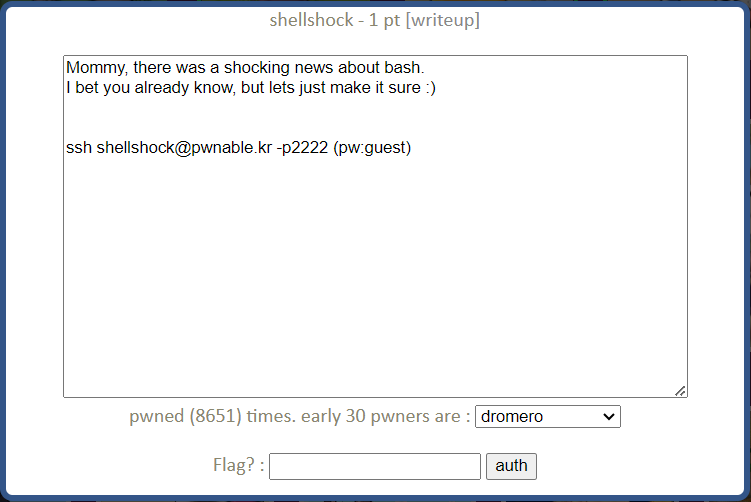
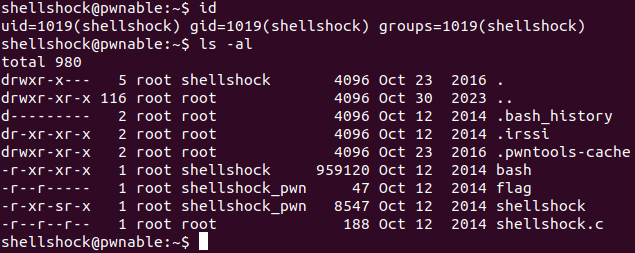

shellshock Solution
========================



이번 문제는 GNU bash의 Shellshock 취약점에 관련된 문제이다. ssh를 통해 접속해 확인해보자.



현재 사용자와 디렉터리 정보이다. 현재 권한으로 실행 가능한 bash, shellshock 파일과 열람 가능한 shellshock.c 소스 코드 파일이 있다. shellshock.c의 내용을 살펴보자.

- shellshock.c

```c
#include <stdio.h>
int main(){
	setresuid(getegid(), getegid(), getegid());
	setresgid(getegid(), getegid(), getegid());
	system("/home/shellshock/bash -c 'echo shock_me'");
	return 0;
}
```

내용은 매우 간단하다. ruid, euid, suid, rgid, egid, sgid를 모두 현재의 egid로 설정 후 /home/shellshock/bash를 실행해 'echo shock_me' 명령어를 실행한다. shellshock 파일은 그룹(shellshock_pwn) 실행 권한에 setuid bit가 설정되어 있다. 따라서 shellshock을 실행했을 때 egid는 shellshock_pwn의 gid인 1020이 된다.(id shellshock_pwn 명령어로 확인해 본 결과 1020 이었다.) /home/shellshock/bash를 1020의 권한으로 실행하게 되는 것이다. 여기서 Shellshock 취약점을 사용하게 되는데, 해당 취약점에 대해 자세히 알아보았다.

---------------------------------

### Shellshock 취약점 (CVE-2014-6271)

